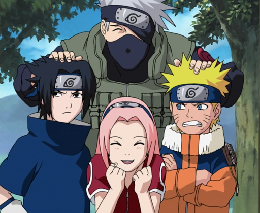

## Team Kakashi (Team 7: Monday Night Session, Fall 2017) 

Clearly the ECE 3400 staff are big fans of Naruto. Why else would they have numbered our group after the legendary Team 7? Whatever you do, DO NOT click on the bottom left corner!!!

### Lab
 - [Lab 1](./docs/lab1)
 - [Lab 2](./docs/lab2)
 - [Lab 3](./docs/lab3)
 - [Lab 4](./docs/lab4)

### Milestone
 - [Milestone 1](./docs/milestone1)
 - [Milestone 2](./docs/milestone2)
 - [Milestone 3](./docs/milestone3)
 - [Milestone 4](./docs/milestone4) 

### [Final Design](./docs/final_design)  

### Contributors
 - JinJie Chen              [jc2554](mailto:jc2554@cornell.edu)
 - Khyati Sipani            [ks965](mailto:ks965@cornell.edu)
 - Adrian Dohmann           [ahd59](mailto:ahd59@cornell.edu)
 - Kenneth Cesar Huaman     [kch96](mailto:kch96@cornell.edu)
 - Amanda Pathmanathan      [ap763](mailto:ap763@cornell.edu)
 - Sanush Nukshan Kehelella [snk32](mailto:snk32@cornell.edu)  

#### [Team Contract](./docs/team_contract)
#### [Meeting Minutes](./docs/meeting_minutes)
#### [Ethics Homework](./docs/ethics_hw)
