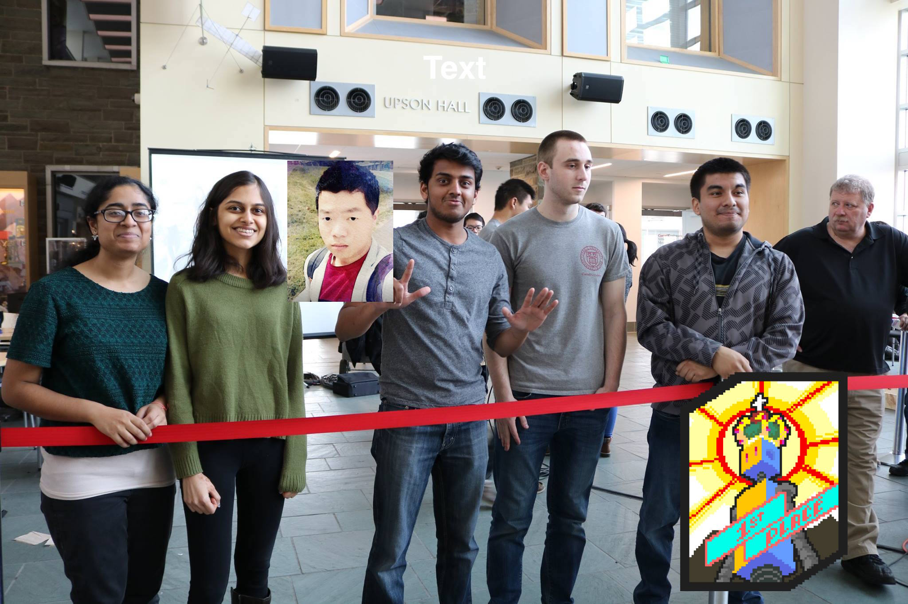

## Team Kakashi (Team 7: Monday Night Session, Fall 2017) 

### Meet the winners of the Fall 2017 ECE 3400 Final Competition!

Clearly the ECE 3400 staff are big fans of Naruto. Why else would they have numbered our group after the legendary Team 7? Whatever you do, DO NOT click on the bottom left corner!!!

### [Final Design and Final Competition](./docs/final_design) 

### Lab
 - [Lab 1](./docs/lab1)
 - [Lab 2](./docs/lab2)
 - [Lab 3](./docs/lab3)
 - [Lab 4](./docs/lab4)

### Milestone
 - [Milestone 1](./docs/milestone1)
 - [Milestone 2](./docs/milestone2)
 - [Milestone 3](./docs/milestone3)
 - [Milestone 4](./docs/milestone4) 

### Contributors
 - JinJie Chen              [jc2554](mailto:jc2554@cornell.edu)
 - Khyati Sipani            [ks965](mailto:ks965@cornell.edu)
 - Adrian
 - Kenneth Cesar Huaman     [kch96](mailto:kch96@cornell.edu)
 - Amanda Pathmanathan      [ap763](mailto:ap763@cornell.edu)
 - Sanush Nukshan Kehelella [snk32](mailto:snk32@cornell.edu)  

#### [Team Contract](./docs/team_contract)
#### [Meeting Minutes](./docs/meeting_minutes)
#### [Ethics Homework](./docs/ethics_hw)
#### [Robot Components and Cost](./docs/cost)
