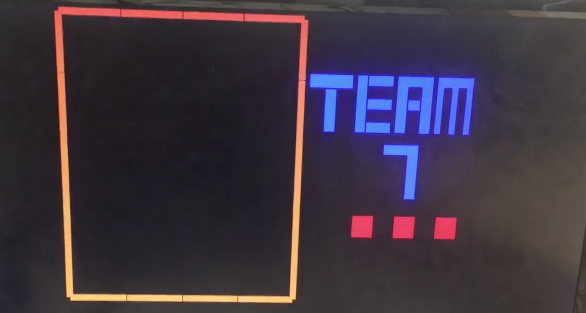
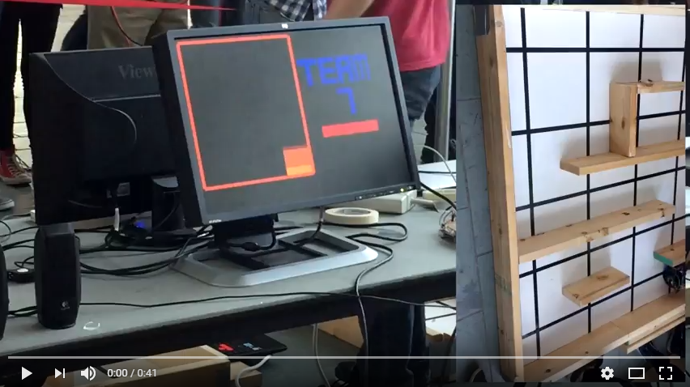
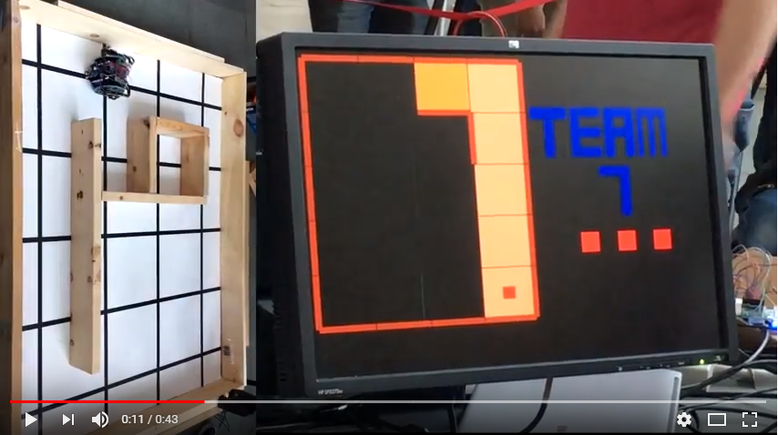

# Final Design
Enhancements beyond milestone 4  

## FPGA
A few modifications were made to our Verilog code to add more sophistication to our display from Milestone 4. We decided to show “done” by coloring the current cell with black and white checkers and displaying “DONE!” in blocked letters to the right of the maze. In addition, we adding blocked text saying “TEAM 7”, and moving ellipses to show that the robot was still mapping the maze. All this can be seen in the video below displaying the final robot mapping the maze.

From Milestone 4, instead of coloring the cell purple when done, we divided the cell into a smaller 5x5 grid. If PIXEL_COORD_X and PIXEL_COORD_Y were in a cell that was supposed to be black, we set PIXEL_COLOR = black. Else, we set it to white. The same methodology was used to draw “TEAM 7” and “DONE!”, as well as the ellipses. 

We configured our display to display the walls bounding the maze at reset. Whilst doing so, the top and left walls were being cut off by the display. To fix this, we shifted our grid down and left by 10 pixels. The image below shows our display at reset:




## Audio
We decided to play the first two lines of “If you’re happy and you know it” instead of a simple 3 tone sound. To do this, we determined the piano notes for the song - for example the first line was “C C F F F F F F F E F G”, and determined the corresponding frequencies for each of these for a particular scale. Then, we created separate modules in Verilog for each of these frequencies by modifying the counter value from the files used in Lab 3 (See Section on Lab 3 for more details). Using the same code structure as Lab 3, we extended counter2 to be 4 bits wide, extended the ternary operator assigning to the GPIO pins to include the longer sequence of tones, and used a longer if statement that changed that value of counter2 after the desired note had been played for a specified time interval. Below is a snippet of the modified code:

```verilog 
assign {GPIO_0_D[26],GPIO_0_D[28],GPIO_0_D[30],GPIO_0_D[32],GPIO_0_D[33],GPIO_0_D[31],GPIO_0_D[29],GPIO_0_D[27]} = 
(counter2 == 4'd0 && done)? t1: (counter2 == 4'd1 && done)? t2: (counter2==4'd2 && done)? t3: (counter2==4'd3 && done)? 
t2: (counter2==4'd4 && done)? t4: (counter2==4'd5 && done)? 0: (counter2==4'd6 && done)? t1: (counter2==4'd7 && done)? 
t4: (counter2==4'd8 && done)? t2: (counter2==4'd9 && done)? t4: (counter2==4'd10 && done)? t5: 0; 

always@(posedge CLOCK_25) begin
if (reset) begin
	counter2 <=0; 
	counter1<=0;
	end
else if (counter1 == 12500000 && counter2 == 0) begin counter2 <= 4'd1; counter1 <= 0; end 
else if (counter1 == 37500000 && counter2 == 1) begin counter2 <= 4'd2; counter1 <= 0; end
else if (counter1 == 12500000 && counter2 == 2) begin counter2 <= 4'd3; counter1 <= 0; end
...
```

## Treasure Sensing
### Treasure Sensor Circuit
The same design was kept as in milestone 4, but the I/O was resoldered. We also readjusted the height to better detect treasures and fit the new chassis design, hot-gluing each sensor to the bottom of the left, right, and center wall sensors. We had to be careful in making sure the wires from the treasure sensors did not interfere with the wall sensors. 
### Amplifier Circuit
The design for the Active High Pass Filter was dropped due to unreliability in performance. One day it would work, the next it would fail. It was decided that a standard non-inverting amplifier would be used for the signal, with an amplitude amplification of 18. This design was also soldered onto a perf board for later use.
## Microphone
The microphone was soldered onto the same board that connected all sensors to the arduino. It was able to successfully detect the 660Hz starting signal. However, the range was not that large until we lowered the threshold so that it could pick up the signal from where the speakers were set during the competition (around 4-5 inches away). We decided not to use the simple RC low pass filter that we made in lab 2 since we still had issues with getting the op amp to work with the filter.  

## Physical Parts
### Wheels
The previous setup was determined to be too slow. At first a gear box was considered, but 3D printing it proved too difficult. So larger wheels were found from a previous year.
### Chassis
The larger size of the wheels now obstructed the placement of the treasure and wall sensors. To accomodate this, a "wing" was designed which would circumvent the wheel and allow mounting of the sensors on the other side. After some difficulties in printing, it was decided that constructing the piece from laser cut acrylic would give better results. To make better use of the material and to give better support to the "wings", a new chasis was laser cut with the wings already incorporated.

### Emergency Start Button
We connected the button to power and ground, using a resistor of 56kOhm. We just directly soldered copper wires to the contacts on the button. This was also connected to the arduino. Fortunately, we did not have to use it during the competition. 

## Final Testing
We set up several different mazes and tried to emulate the final competition scenario. For example, we made sure our robot moved at the start signal and adjusted our threshold accordingly, and also adjusted our threshold for treasure detection. We set up tight mazes that would challenge our robot's turning capabilities, and made sure our robot was able to traverse through. We also charged spare power banks over night so we were prepared for the day of the competition!


First round of the competition:
[](https://youtu.be/jJJJDXnB0to) 

Final round of the competition:
[](https://youtu.be/WRyaERyyyag) 

## Future Improvements
