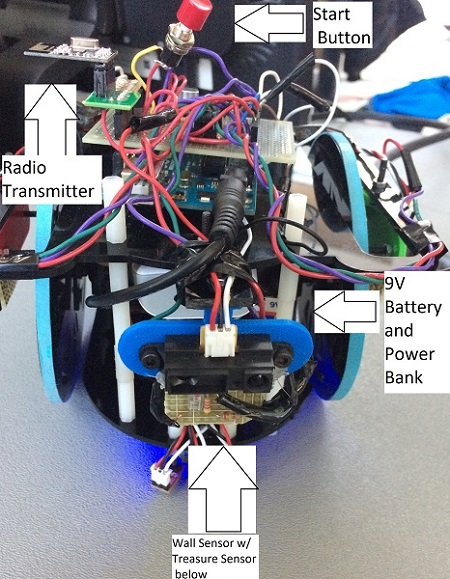

# Final Design

## Introduction and Motivations
For the final design of the robot, we built on our progress from the previous labs and milestones. Some modifications were made to the made display, the done signal, treasure sensing, and the overall robot structure and wiring. The search algorithm was unchanged. Our focus during the last few days before the final competition was to achieve a fast speed that did not compromise on wall detection and treasure detection, have reliable communication between the FPGA and Arduino, and add to the project stylistically - a more sophisticated done signal, a creative display, and finally a nicer looking robot!

## FPGA
A few modifications were made to our Verilog code to add more sophistication to our display from Milestone 4. We decided to show “done” by coloring the current cell with black and white checkers and displaying “DONE!” in blocked letters to the right of the maze. In addition, we adding blocked text saying “TEAM 7”, and moving ellipses to show that the robot was still mapping the maze. All this can be seen in the video below displaying the final robot mapping the maze.

From Milestone 4, instead of coloring the cell purple when done, we divided the cell into a smaller 5x5 grid. If PIXEL_COORD_X and PIXEL_COORD_Y were in a cell that was supposed to be black, we set PIXEL_COLOR = black. Else, we set it to white. The same methodology was used to draw “TEAM 7” and “DONE!”, as well as the ellipses. 

We configured our display to display the walls bounding the maze at reset. Whilst doing so, the top and left walls were being cut off by the display. To fix this, we shifted our grid down and left by 10 pixels. The image below shows our display at reset:


## Audio
We decided to play the first two lines of “If you’re happy and you know it” instead of a simple 3 tone sound. To do this, we determined the piano notes for the song - for example the first line was “C C F F F F F F F E F G”, and determined the corresponding frequencies for each of these for a particular scale. Then, we created separate modules in Verilog for each of these frequencies by modifying the counter value from the files used in Lab 3 (See Section on Lab 3 for more details). Using the same code structure as Lab 3, we extended counter2 to be 4 bits wide, extended the ternary operator assigning to the GPIO pins to include the longer sequence of tones, and used a longer if statement that changed that value of counter2 after the desired note had been played for a specified time interval. Below is a snippet of the modified code:

```verilog 
assign {GPIO_0_D[26],GPIO_0_D[28],GPIO_0_D[30],GPIO_0_D[32],GPIO_0_D[33],GPIO_0_D[31],GPIO_0_D[29],GPIO_0_D[27]} = 
(counter2 == 4'd0 && done)? t1: (counter2 == 4'd1 && done)? t2: (counter2==4'd2 && done)? t3: (counter2==4'd3 && done)? 
t2: (counter2==4'd4 && done)? t4: (counter2==4'd5 && done)? 0: (counter2==4'd6 && done)? t1: (counter2==4'd7 && done)? 
t4: (counter2==4'd8 && done)? t2: (counter2==4'd9 && done)? t4: (counter2==4'd10 && done)? t5: 0; 

always@(posedge CLOCK_25) begin
if (reset) begin
	counter2 <=0; 
	counter1<=0;
	end
else if (counter1 == 12500000 && counter2 == 0) begin counter2 <= 4'd1; counter1 <= 0; end 
else if (counter1 == 37500000 && counter2 == 1) begin counter2 <= 4'd2; counter1 <= 0; end
else if (counter1 == 12500000 && counter2 == 2) begin counter2 <= 4'd3; counter1 <= 0; end
...
```

## Treasure Sensing
### Treasure Sensor Circuit
The same design was kept as in milestone 4, but the I/O was resoldered. We also readjusted the height to better detect treasures and fit the new chassis design, hot-gluing each sensor to the bottom of the left, right, and center wall sensors. We had to be careful in making sure the wires from the treasure sensors did not interfere with the wall sensors. 
### Amplifier Circuit
The design for the Active High Pass Filter was dropped due to unreliability in performance. One day it would work, the next it would fail. It was decided that a standard non-inverting amplifier would be used for the signal, with an amplitude amplification of 18. This design was also soldered onto a perf board for later use.
## Microphone
The microphone was soldered onto the same board that connected all sensors to the arduino. It was able to successfully detect the 660Hz starting signal. However, the range was not that large until we lowered the threshold so that it could pick up the signal from where the speakers were set during the competition (around 4-5 inches away). We decided not to use the simple RC low pass filter that we made in lab 2 since we still had issues with getting the op amp to work with the filter.  

## Physical Parts
### Wheels
The previous setup was determined to be too slow. At first a gear box was considered, but 3D printing it proved too difficult. So larger wheels were found from a previous year.
### Chassis
The larger size of the wheels now obstructed the placement of the treasure and wall sensors. To accomodate this, a "wing" was designed which would circumvent the wheel and allow mounting of the sensors on the other side. After some difficulties in printing, it was decided that constructing the piece from laser cut acrylic would give better results. To make better use of the material and to give better support to the "wings", a new chasis was laser cut with the wings already incorporated.

### Emergency Start Button
We connected the button to power and ground, using a resistor of 56kOhm. We just directly soldered copper wires to the contacts on the button. This was also connected to the arduino. Fortunately, we did not have to use it during the competition.

### LEDs
This was purely for fun. We ordered a pack of LEDs strings that came in different colors and were powered by their own battery pack, which made it easy to add to the robot at the end. This meant it would not interfere with the robot's functions in any way besides taking up some space. We lined blue LEDs around the bottom of the robot so that it would reflect against the white maze as it moved during the competition. They also complimented the blue rims on our wheels.

Below is a labelling of the parts of our robot:





## Algorithm
Previously, our robot solely used Dijkstra's shortest path algorithm to navigate the maze. Every time it arrived on an unoccupied space, it would perform Dijkstra's algorithm to find the nearest unexplored space and move over the shortest path to it. Our implementation of Dijkstra's algorithm does not take into account the time taken to turn when finding the shortest path. We considered adding this functionality and found that our most efficient implementation idea would still at least double the dynamic memory usage, quadrouple the run time, and greatly increase the complexity of the algorithm, with little, if any, actual performance gain. Because of this, we decided against changing our shortest path alorithm and instead opted to change how it was used. In practice, most of the time the space to the front of the robot is unexplored and accessible. In this case, we would always like to move forward. Our algorithm would often chose to move to unexplored spaces to the left or right in this case. We found that simply having the robot move forward if the space to the front is both unexplored and accessible and using Dijkstra's algorithm to move to the nearest unexplored location otherwise would accomplish mostly the same outcome as implementing turning time into Dijkstra's algorithm, so that's what we did. 

## Final Testing
We set up several different mazes and tried to emulate the final competition scenario. For example, we made sure our robot moved at the start signal and adjusted our threshold accordingly, and also adjusted our threshold for treasure detection. We set up tight mazes that would challenge our robot's turning capabilities, and made sure our robot was able to traverse through. We found that the larger wheels and wider chassis of our new robot brought to light minor problems with movement that were not visible in our original build. Because the new wheels are nearly twice the diameter of the old wheels, our robot moves nearly twice as fast as before. Slight imbalances of speed between the servos became very apparent. The wider chassis additionally brought the possibility of scraping walls during turns. We were able to easily fix these issues by readjusting our servo speeds during line following and turning.

We also charged spare power banks over night so we were prepared for the day of the competition! If there are any new problems you run across in the finals days before competition (servos suddenly malfunctioning) definitely check your 5-V power bank and 9-V battery with a multimeter to make sure they are actually delivering the voltage they should be!  

Many of our soldered connections were made earlier in the semester so we noticed that a lot of the sensors stopped working here and there because of connections coming apart. We basically resoldered all the wires at some point before the final competition-- the braided wires that came from the servos were particularly difficult to solder. So definitely look at those connections when debugging! (between copper wires, braided wires, and make sure there are no shorted wires on perf boards, etc.)

A few more tips to help save time (simple things that people forget):
1. Make sure to check the datasheets for all sensors and parts you use, make sure you ground/power them accordingly!
2. It never hurts to double check pin assignments!
3. Use the println() when debugging: it prints data from the sensors on the serial monitor so you can see exactly what is happening.
4. Make sure vdd and gnd are not shorted BEFORE turning power on. 


First round of the competition:
[](https://youtu.be/jJJJDXnB0to) 

Final round of the competition:
[](https://youtu.be/WRyaERyyyag) 

## Future Improvements
If we had the chance to improve our robot, there are a few things we would do:
1. Use PCBs intead of perf boards, as it would make the robot look neater
2. Fine tune the turning of our robot
3. Implement Serial communication instead of parallel communication from the FPGA to the Arduino as it would use less pins
4. Cleaner wiring - possibly incorporate color coding

## Conclusion
This class was a great learning experience! Not only did we all grow our skillsets, we most importantly learned how to build off each other's strengths as a team and enjoy the experience of working with each other. We are all very proud of our robot, and would like to thank the ECE 3400 course staff for all their help and inspiration!
