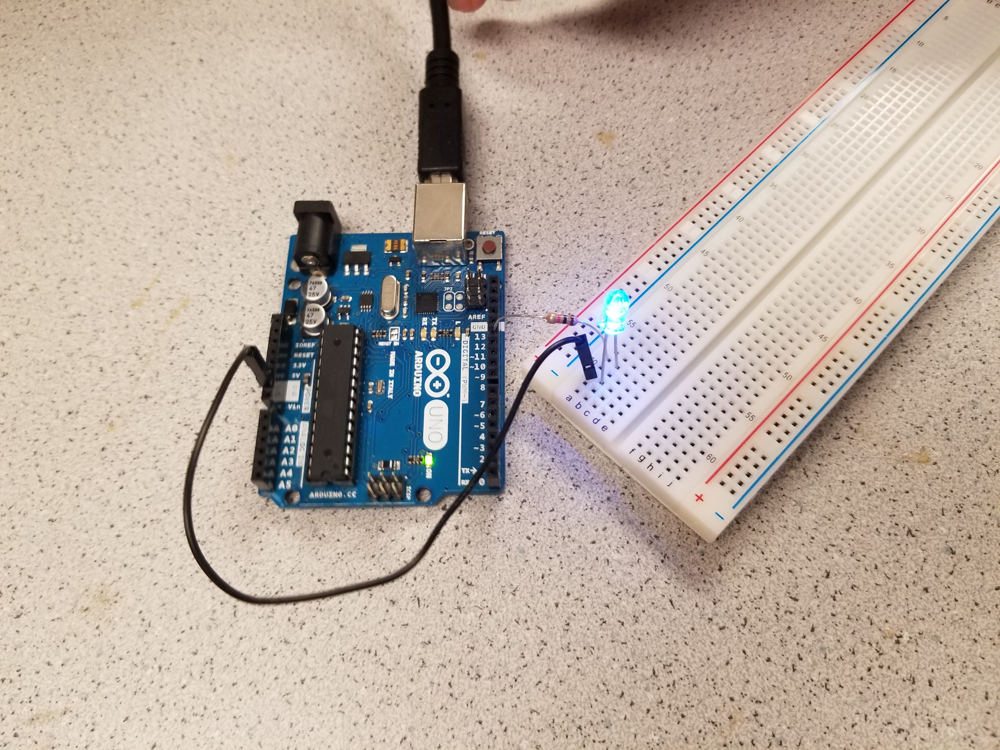

# Lab 1

## Goal
Learn basic functionalities of the Arduino Uno and the Arduino IDE, and assembly a basic robot to perform a simple autonomous task.

## Lab Procedure

 - Installed Arduino IDE  
[Download Link](https://www.arduino.cc/en/Main/Software)

 - Test example code "Blink"  
 The example can be found under: File > Examples > 1.Basics > Blink

 
 - 
