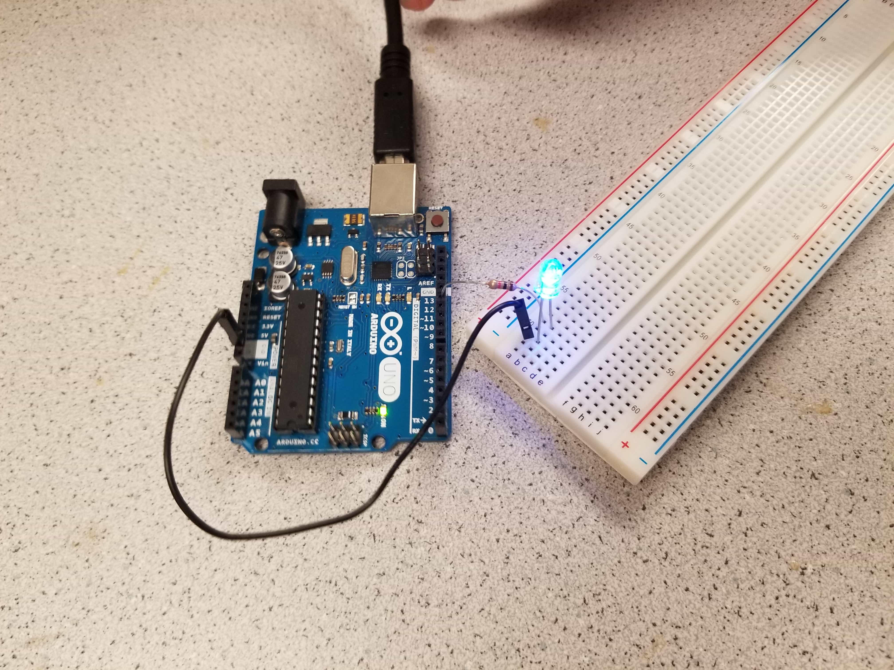
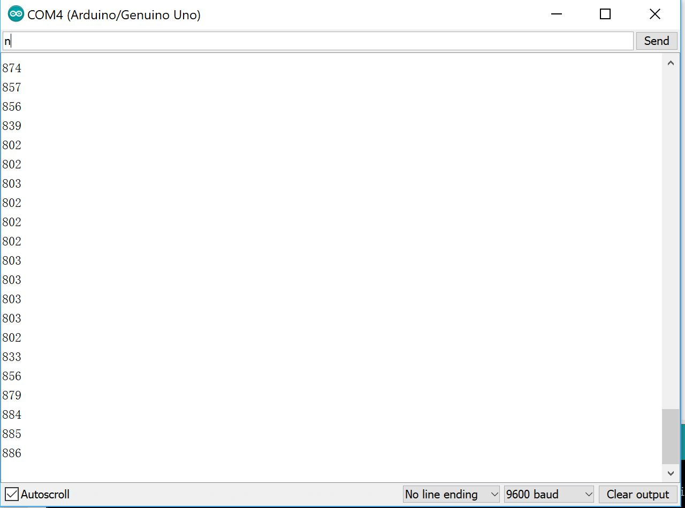
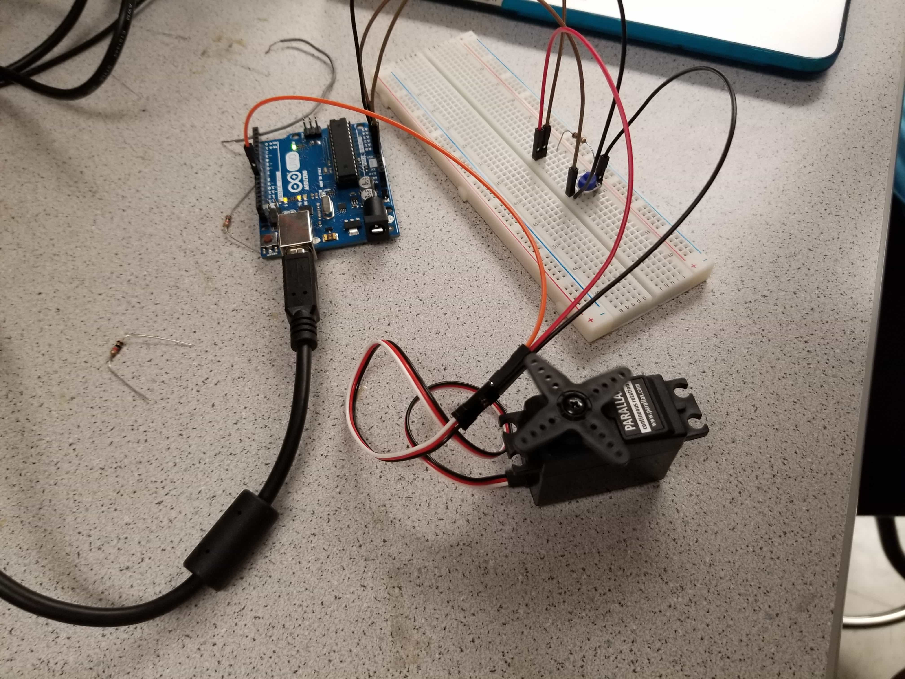

# Lab 1

## Goal
Learn basic functionalities of the Arduino Uno and the Arduino IDE, and assembly a basic robot to perform a simple autonomous task.

## Sub-team
1. JinJie Chen; Amanda Pathmanathan
2. Kenneth Cesar Huaman; Khyati Sipani; Adrian Higgins Dohmann  
Sanush Nukshan Kehelella hadn't joined the team yet

## Lab Procedure

 - Installed Arduino IDE  
[Download Link](https://www.arduino.cc/en/Main/Software)

 - We first tested the example code "Blink"  
 The example can be found under: File > Examples > 1.Basics > Blink  
 
```C
void setup() {
  // initialize digital pin LED_BUILTIN as an output.
  pinMode(LED_BUILTIN, OUTPUT);
}
// the loop function runs over and over again forever
void loop() {
  digitalWrite(LED_BUILTIN, HIGH);   // turn the LED on (HIGH is the voltage level)
  delay(1000);                       // wait for a second
  digitalWrite(LED_BUILTIN, LOW);    // turn the LED off by making the voltage LOW
  delay(1000);                       // wait for a second
}
```  
[](https://www.youtube.com/watch?v=gp3k0bbmByw)  
 - The following code tests blink function on an external LED:  
 
```C
void setup() {
  // initialize digital pin LED_BUILTIN as an output.
  pinMode(5, OUTPUT);
}
// the loop function runs over and over again forever
void loop() {
  digitalWrite(5, HIGH);   // turn the LED on (HIGH is the voltage level)
  delay(1000);                       // wait for a second
  digitalWrite(5, LOW);    // turn the LED off by making the voltage LOW
  delay(1000);                       // wait for a second
}
```

[](https://www.youtube.com/watch?v=rXavyW0d1EY)  

 - We displayed the value of a potentiometer via the serial port to the screen by adding the following code:
 
```C
 Serial.begin(9600);    //Sets the data rate in bits per second (baud) for serial data transmission.
 value = analogRead(PIN_IN); //reading the value from the potentiometer
 Serial.println(value); //Prints value to the serial port as human-readable ASCII text.
```

   
 
 - We mapped the value of the potentiometer to the analog output of an external LED.  
 
```C
  value = analogRead(PININ);//Reads an ADC conversion from pin A0 using default settings for the ADC.
  Serial.println(value);//print value to screen
  delay(100);//wait .1 sec
  analogWrite(PINOUT,value>>2);//write value out to the LED
```  
 
 [](https://www.youtube.com/watch?v=vbGv5mdMXzc)  
 Oscilloscope: Freq at ~50Hz
   
 - We used the servo.h library to control a servo motor  
 
```C
 #include <Servo.h>  //import Library
Servo servo1;      //Declare instance of servo
servo1.attach(10); //Attach the servo input to pin 10 (PWM)
servo1.write(0);   //ouputting 0 = max speed reverse, 90 = stop, 180 = max speed forward
```  

[](https://www.youtube.com/watch?v=Fmpl8Q5mNHA)  
Oscilloscope: Freq at ~50Hz
  
  

 - We assembled the robot with basic parts  
  
 - Lastly, we made the robot move in a octagon, but the timing for the motor still needs to be tuned more finely to make precise turns.  
 
 ```C
 void loop() {
  servo1.write(0); //servo1 go forward
  servo2.write(180); //servo2 go forward
  delay(1000); //Go forard for 1 second
  servo1.write(90); //servo1 stop
  delay(500); //Turn for .5 second
 }
 ```
 
[](https://youtu.be/gRwe7V_8tsg)


### Useful Resource
 - This [wiki page](https://github.com/adam-p/markdown-here/wiki/Markdown-Cheatsheet) contain useful reference on how to creat a github page with Markdown  
 
