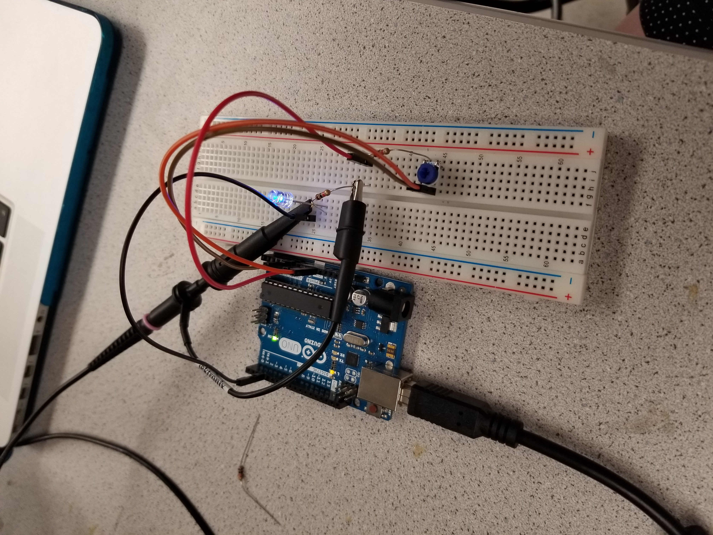
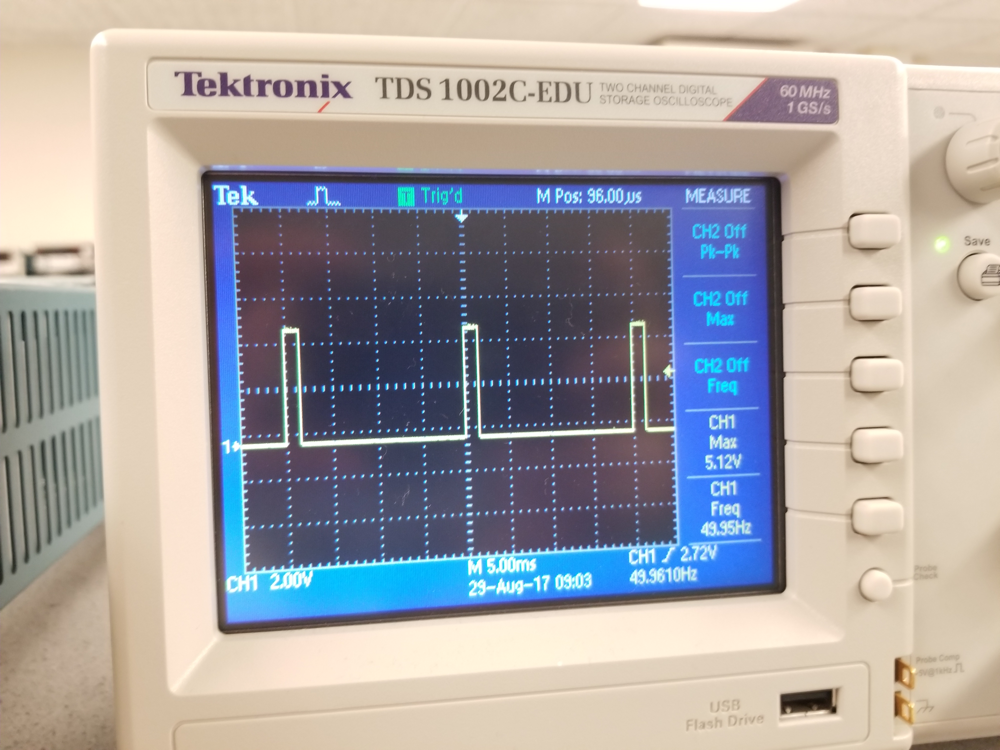
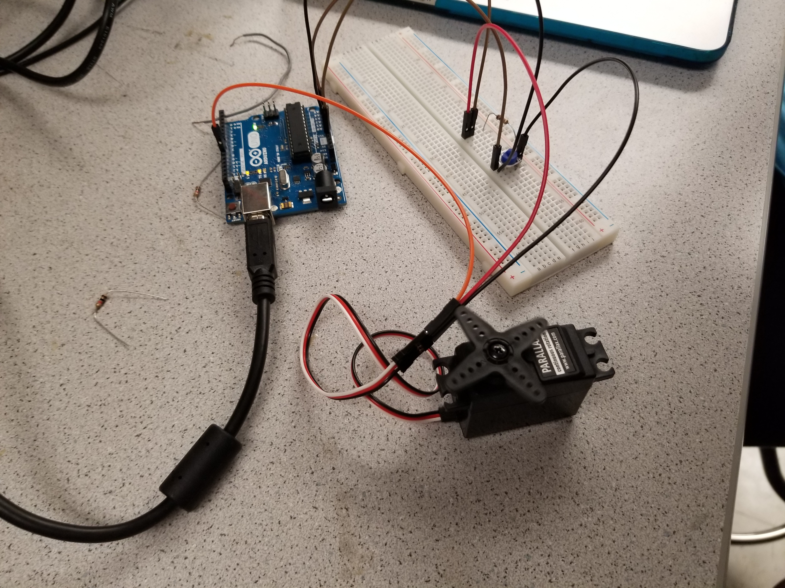
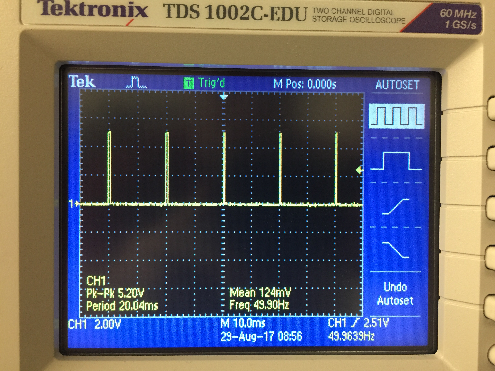
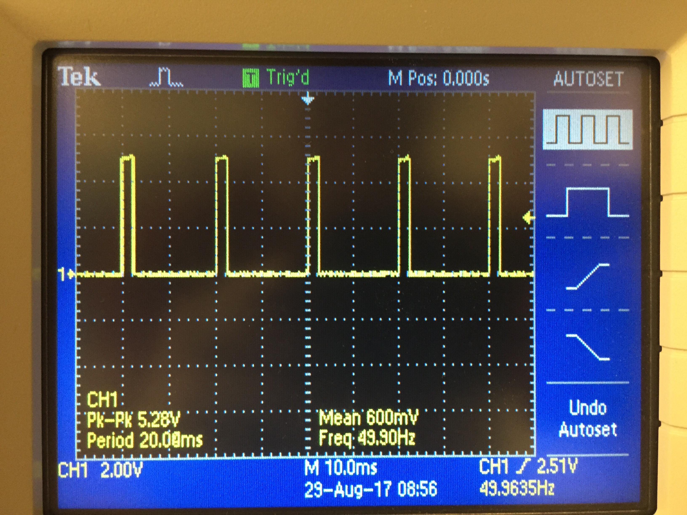
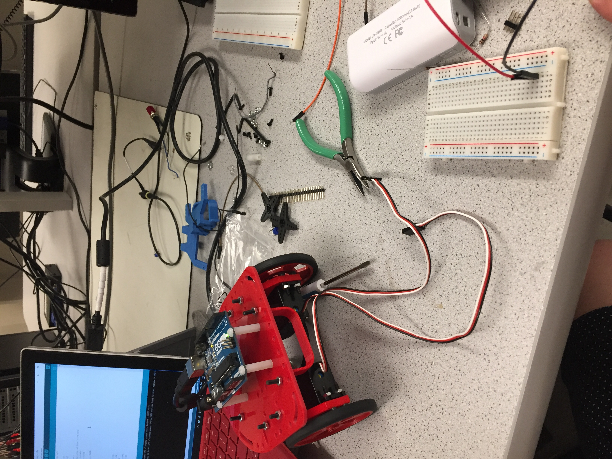
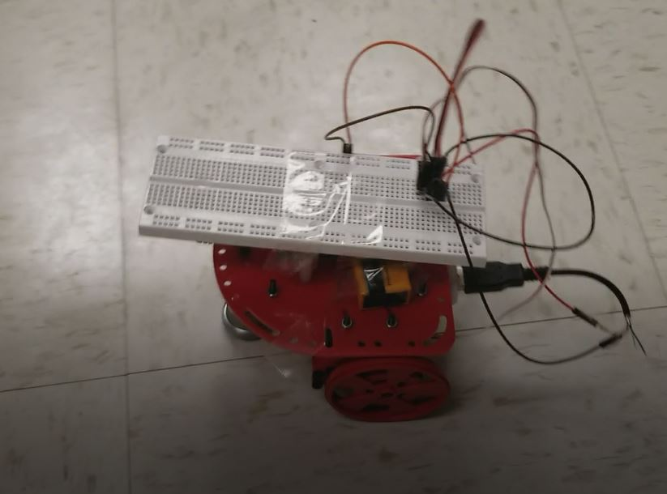

# Lab 1

## Goal
Learn basic functionalities of the Arduino Uno and the Arduino IDE, and assembly a basic robot to perform a simple autonomous task.

## Lab Procedure

 - Installed Arduino IDE  
[Download Link](https://www.arduino.cc/en/Main/Software)

 - Test example code "Blink"  
 The example can be found under: File > Examples > 1.Basics > Blink  
 
```C
void setup() {
  // initialize digital pin LED_BUILTIN as an output.
  pinMode(LED_BUILTIN, OUTPUT);
}
// the loop function runs over and over again forever
void loop() {
  digitalWrite(LED_BUILTIN, HIGH);   // turn the LED on (HIGH is the voltage level)
  delay(1000);                       // wait for a second
  digitalWrite(LED_BUILTIN, LOW);    // turn the LED off by making the voltage LOW
  delay(1000);                       // wait for a second
}
```  
  
 - The following code test blink function on an external LED  
 
```C
void setup() {
  // initialize digital pin LED_BUILTIN as an output.
  pinMode(5, OUTPUT);
}
// the loop function runs over and over again forever
void loop() {
  digitalWrite(5, HIGH);   // turn the LED on (HIGH is the voltage level)
  delay(1000);                       // wait for a second
  digitalWrite(5, LOW);    // turn the LED off by making the voltage LOW
  delay(1000);                       // wait for a second
}
```

[](https://www.youtube.com/watch?v=rXavyW0d1EY&index=6&list=PLsmnUvbbrDnUrtgCasNMCRTeo7MZhXyRG&index=4)  
 - Take potentiometer as the analog input and write analog output to an external LED.  
 
 ```C
  value = analogRead(PININ);//Reads an ADC conversion from pin A0 using default settings for the ADC.
  Serial.println(value);//print value to screen
  delay(100);//wait .1 sec
  analogWrite(PINOUT,value>>2);//write value out to the LED
 ```  
 
 [](https://www.youtube.com/watch?v=vbGv5mdMXzc&list=PLsmnUvbbrDnUrtgCasNMCRTeo7MZhXyRG&index=3)  
 Oscilloscope: Freq at ~50Hz
   
 - Using the servo.h library to controlled a servo motor  
 
 ```C
 #include <Servo.h>  //import Library
Servo servo1;      //Declare instance of servo
servo1.attach(10); //Attach the servo input to pin 10 (PWM)
servo1.write(0);   //ouputting 0 = max speed reverse, 90 = stop, 180 = max speed forward
```  

[](https://www.youtube.com/watch?v=vbGv5mdMXzc&list=PLsmnUvbbrDnUrtgCasNMCRTeo7MZhXyRG&index=1)  
Oscilloscope: Freq at ~50Hz
  
  
 - We assembled the robot with basic parts  
  
 - Last, we made the robot to drive in a octagon, but the timing for the motor need to be tune more finely to make precise turns.  
[](https://youtu.be/gRwe7V_8tsg)

  
  

