# Lab 2

## Goals:
The goal of the Audio subteam was to build a microphone circuit that will detect a 660Hz whistle blow signifying the beginning of your maze mapping. The microphone should be able to detect the starting signal despite excessive background noise (There will be an emergency start button just in case!)

The goal of the Optical subteam was to receive and categorize IR signals of varying frequencies from a treasure circuit. What factors go into locating the treasure during actual operation should be considered.

## Sub- teams:
### Optical 
1. JinJie Chen; Kenneth Huaman; Adrian Higgins Dohmann
### Audio
2. Amanda Pathmanathan; Khyati Sipani; Sanush Nukshan Kehelella

## Lab Procedure

### Audio
We started off by soldering some pins to our microphone in order to place it on the breadboard. 

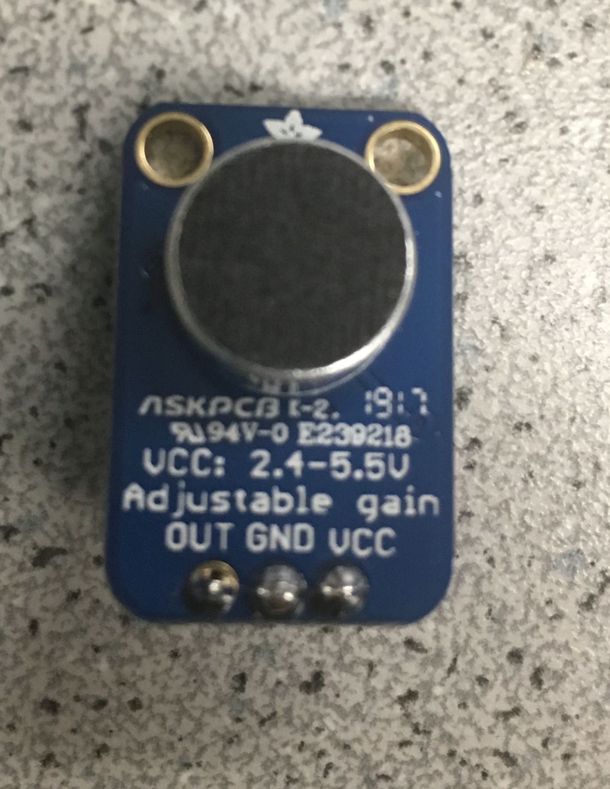       

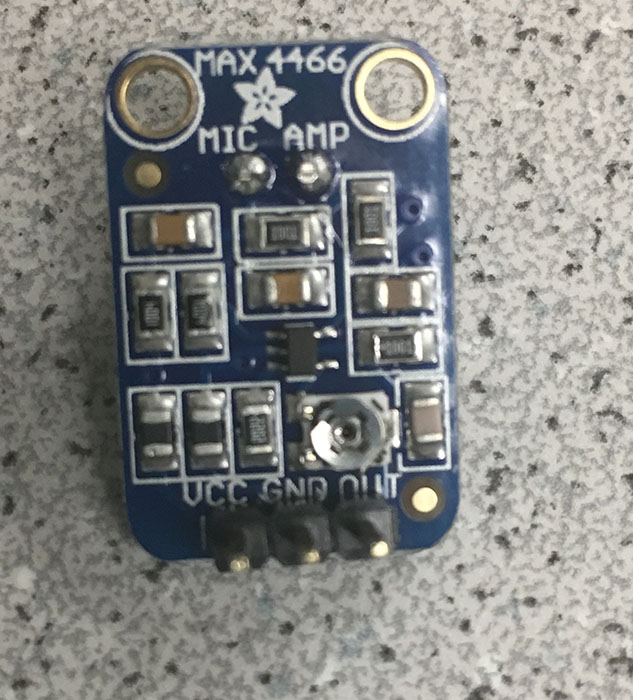

From our Prelab, we discovered that AnalogRead would be sufficient for sampling a 660 Hz signal. From [Show Info](https://playground.arduino.cc/Main/ShowInfo), we figured that AnalogRead takes 111.987 microseconds, giving a sampling frequency of 1/.000111987 = ~8930Hz. This would be sufficient to read a signal at 660Hz (since our sampling frequency needs to be at least 2x660!) The ADC would be better for the Optical subteam since they need to detect signals of around 7-17kHZ!

We wrote our FFT code using AnalogRead() as below: 
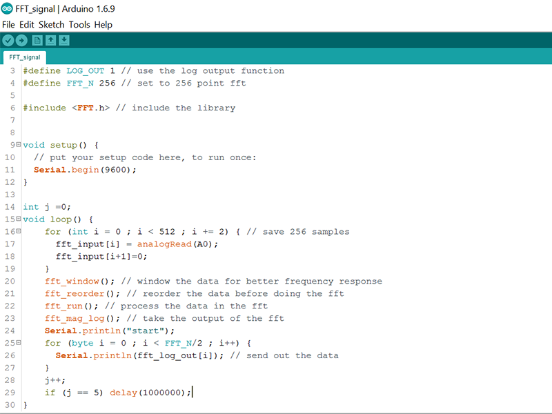

To test our code first, we used the function generator to generate a 660 Hz signal (the one that we would be detecting) instead of the online tone generator The function generator was connected to A0 with a 300 ohm resistor in series. Here is a picture of our circuit:
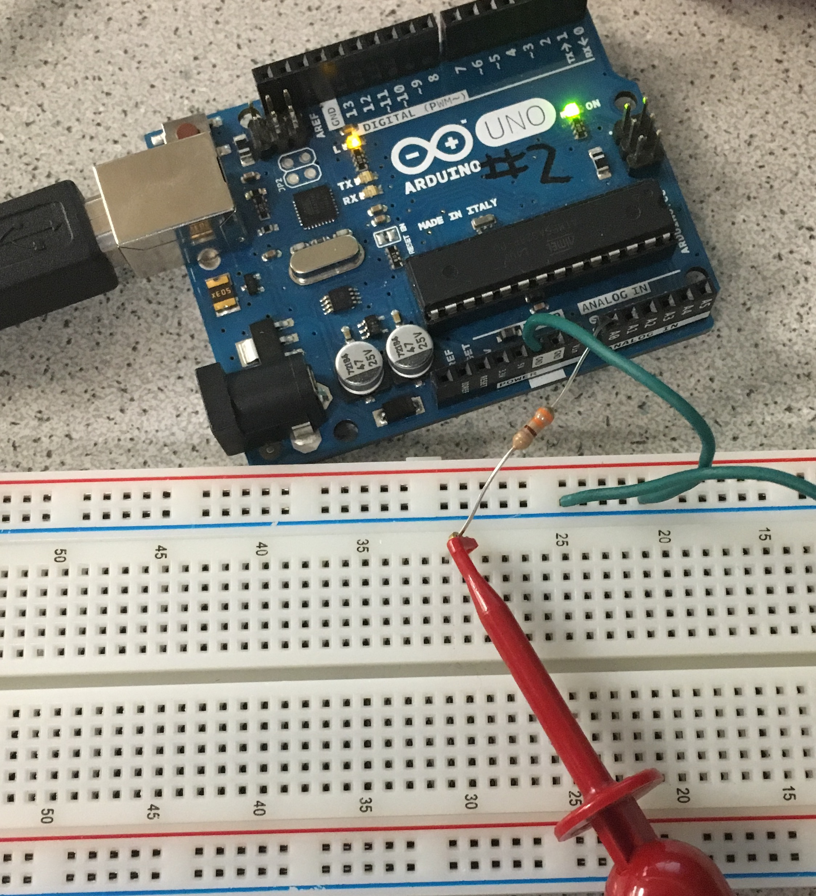

Our results from the serial monitor for the function generator: 
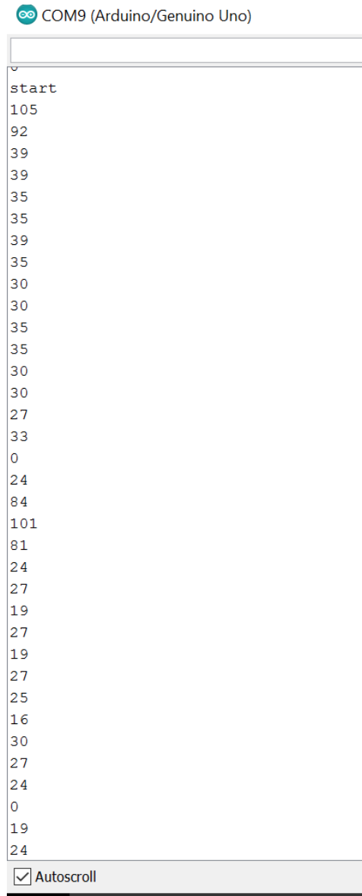

The peak values kept appearing in both the 1st and 20th! Since our sampling frequency was 8930 Hz, and we took 256 samples, each bin would be 8930/256 = 34.9 Hz wide. Hence the 20th bin would have range 663 - 698 Hz, and it makes sense to see a peak in the 20th bin. However, we were unable to understand the peak in the first bin. The value for the second bin also seemed really high.

We then generated a 660 Hz tone using an [online tone generator](http://www.szynalski.com/tone-generator/). After connecting the circuit to the microphone instead of the function generator, we again saw a spike in the 1st, 2nd, and 20th bin: 

Our results from the serial monitor for the microphone signal: 

The peak in the 20th bin means our FFT code is working. But we have peaks in the 1st and 2nd bins as well - it probably has something to do with the circuit or breadboard. When forming the code for detecting the start signal later on, we can ignore the value in the first two bins if the peaks keeps on appearing.

To make improvements to the results of the FFT, we built a simple RC low pass filter with a break frequency of about 700Hz, to filter out some of the high frequency noise from the microphone signal. We chose a low pass filter because most of the noise in our signal seemed to be at higher frequencies. The values of R and C for the filter was calculated using the following formula, where f is the break frequency:
 
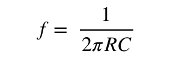

The following set up was used:

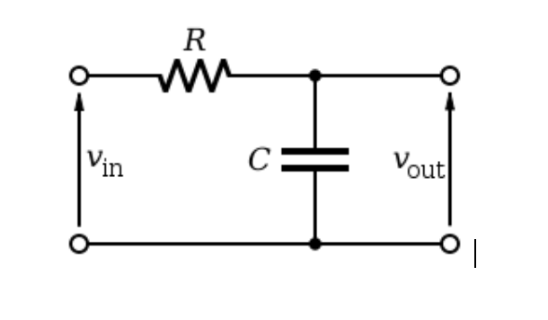

We then tested the circuit, and we observed signal attenuation beyond around 720Hz.
We wanted to then amplify the filtered signal, before the signal was processed by the Arduino. We set up the LM358 dual op-amp in an inverting configuration with a gain of 4. Since we didn’t have a negative supply, we needed a DC offset of about 2.5V for the signal to not clip. We first tested the op amp in isolation providing a DC offset using the power supply. It worked as expected, with a gain close to 4 and with inversion. 
The inverting configuration:

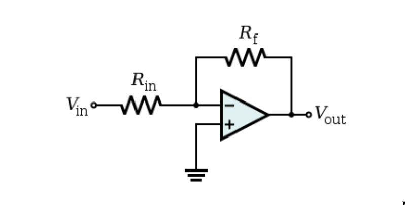

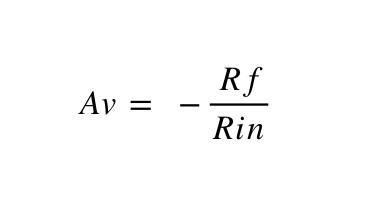

The circuit assembled on a breadboard:

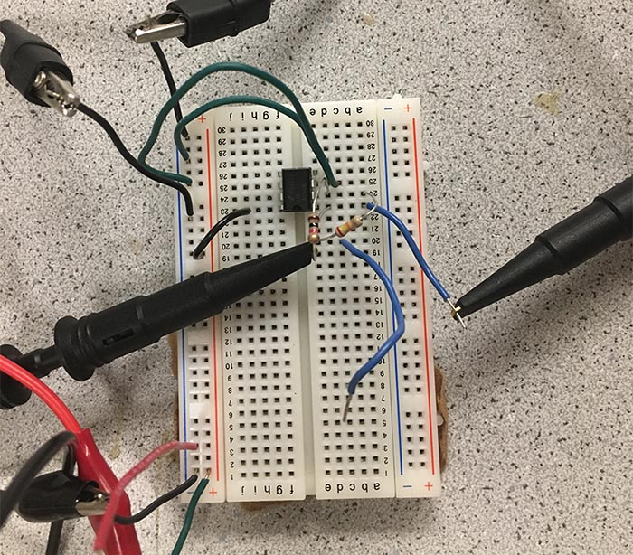

However, we were not able to get the op amp working with the filter yet, because the filter disrupted the DC offsetting of the op amp. We needed to AC couple the filtered signal, using an appropriate capacitor in series with the signal path. We tried various capacitors, but it hasn’t worked yet. More work will be done to get the two circuits working together. We might also switch to a band pass sallen-key filter in future if the need arises. 

### Optical
The treasure circuit, once given a battery and turned on, had settings to optimize frequency and intensity of the IR light.
Using the FFT, the spectral decomposition of several treasure frequencies was recorded
The lab handout detailed the photoresistor be connected as the left diagram below, but in accordance with the advice of the TA and team alpha, it was changed to the diagram below to the right.

                  

As specified with the audio subteam, the ADC is necessary over the analogread() function for the Arduino, since the nyquist frequency requires that a sampling of at least 34kHz(twice the highest 17kHz led frequency) be used, when the maximum sampling from the analogRead() is roughly 9kHz. The full circuit including the connection to the Analog-0 port of the Arduino can be seen below.

The fft library from openmusiclabs provides the following fft algorithm which makes use of the adc as opposed to an analogread().

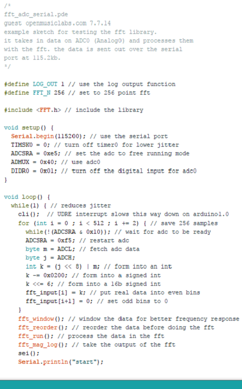

To set up a test of the circuit, the oscilloscope was used to measure the output of the photoresistor when the treasure sensor was 3cm away. The treasure sensor was calibrated to roughly 7kHz by directly connecting to the oscilloscope prior and the intensity was turned up to half. The output from the oscilloscope when connected to the photoresistor picked up 7.123kHz.

The magnitude of the received signal dies off with distance(since magnitude here is intensity, it is an inverse quadratic relation). For future tests, an active filter will most likely be necessary to amplify a certain range or ranges of frequency, especially considering the variablility of the intensity and the ambient noise contributions that would otherwise mask. The fft_adc_serial.pde example code from the openmusiclabs fft library was used as a base, and then modified slighly to print out the dominant components(by log-scale) of the decomposed signal. A sample of the modified portion can be seen below: 
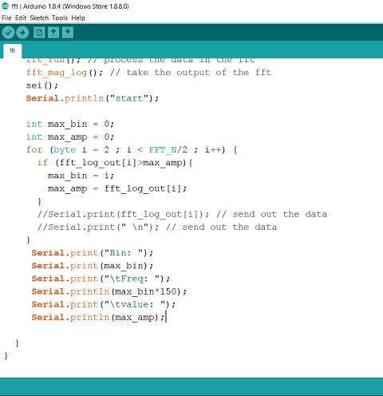

Given the list of possible frequencies for the treasure, the corresponding FFTs of the received signal were captured and superimposed as seen below, where each bin is roughly 150Hz apart.

All spectra had a strong DC component along with significant low frequency contribution. Sunlight is most likely the cause of the DC component, while fluorescent light flickers at 120 Hz, since the mains hum(from the AC electrical system) is at 60 Hz and the light would hum at twice that frequency. A high pass filter would help ignore these components. The tentative design is: 

The biggest source for concern is that this algorithm takes up 16% of program storage space and 66% of dynamic memory, which would, for future addtions, interfere with space allocation for other subsystems of the robot.
