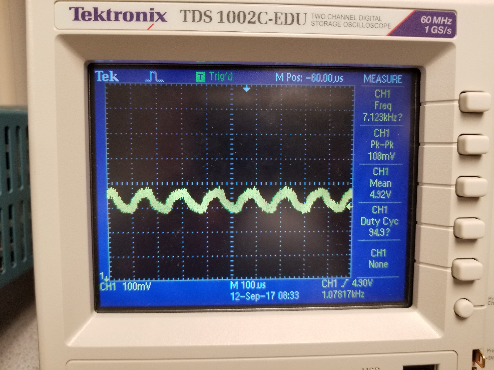

# Lab 2
(VERY ROUGH ATTEMPT< FEEL FREE TO EDIT
## Goal
To implement the filter

## Sub- team
1. JinJie Chen; Kenneth Huaman; Adrian Higgins Dohmann
2. Amanda Pathmanathan; Khyati Sipani; Sanush Nukshan Kehelella

## Lab Procedure

### Audio

### Optical
The treasure circuit, once given a battery and turned on, had settings to optimize frequency and intensity of the IR light.
The FFT algorithm was used from ..........
Using the FFT, the spectral decomposition of several treasure frequencies was recorded

The oscilloscope was then used to measure the output of the photoresistor when the treasure sensor was 3cm away. The treasure sensor was calibrated to roughly 7kHz by directly connecting to the oscilloscope prior and the intensity was turned up to half. The output from the oscilloscope when connected to the photoresistor picked up 7.123kHz, where the magnitude dies off with distance. For future tests, an amplifier will most likely be necessary, considering the variablility of the intensity and the ambient noise contributions that would otherwise mask.(think about this)

.png)
ECE3400-team7/docs/image/lab2/2_1.jpg
