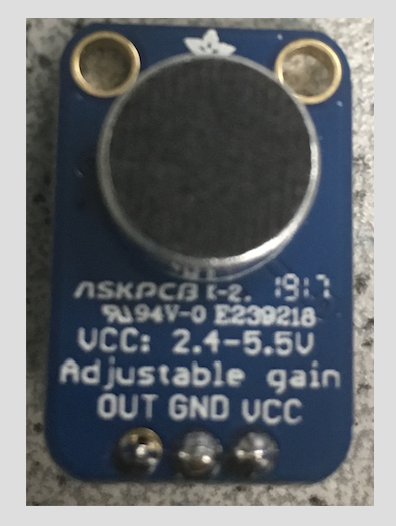
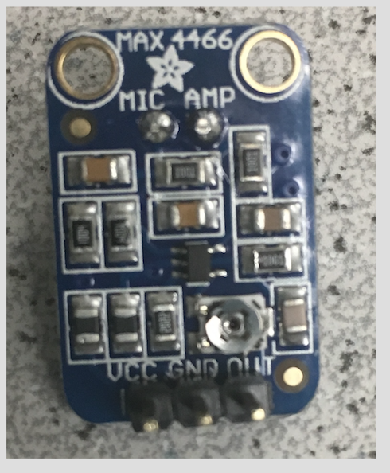
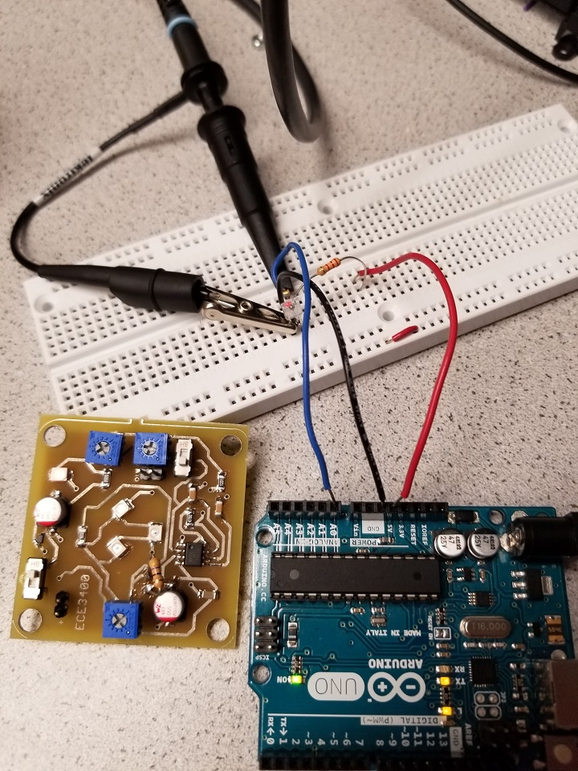
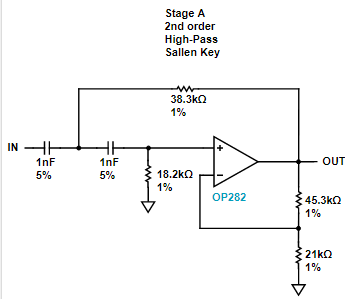

# Lab 2
(VERY ROUGH ATTEMPT< FEEL FREE TO EDIT
## Goals:
The goal of the Audio subteam was to build a microphone circuit that will detect a 660Hz whistle blow signifying the beginning of your maze mapping. The microphone should be able to detect the starting signal despite excessive background noise (There is still an emergency start button just in case!)

The goal of the Optical subteam was to receive and categories IR signals of varying frequencies from a treasure circuit. What factors go into locating the treasure during actual operation should be considered.

## Sub- teams:
### Optical 
1. JinJie Chen; Kenneth Huaman; Adrian Higgins Dohmann
### Audio
2. Amanda Pathmanathan; Khyati Sipani; Sanush Nukshan Kehelella

## Lab Procedure

### Audio
We started off by soldering some pins to our microphone in order to place it on the breadboard. 

       

To test our microphone, we used the function generator and measured the signal produced on the oscilloscope. 
Despite changing the gain on the microphone, we decided that an opamp would still be needed to amplify the signal. 
We are using the analogRead function over the ADC itself since:
1/.0001= 10000Hz which is sufficient to read a signal at 660Hz (max would be 2660!)
The ADC would be better for the other subteam since they need to detect signals of around 7-17kHZ!

The code that was loaded onto the arduino:
insert image

Our results from the serial monitor: 

The maximum values kept appearing in two bins: the 1st and 20th! The 20th bin was what we were expecting, but the 1st bin response seems to be the result of DC. 

We have also tried assembling the circuit for a non-inverting opamp, here is how far we got during lab:

### Optical
The treasure circuit, once given a battery and turned on, had settings to optimize frequency and intensity of the IR light.
The FFT algorithm was used from ..........
Using the FFT, the spectral decomposition of several treasure frequencies was recorded
The lab handout detailed the photoresistor be connected as the left diagram below, but in accordance with the advice of the TA and team alpha, it was changed to the diagram below to the right.

                  

The full circuit including the connection to the Analog-0 port of the Arduino can be seen below.

To set up a test of the circuit, the oscilloscope was used to measure the output of the photoresistor when the treasure sensor was 3cm away. The treasure sensor was calibrated to roughly 7kHz by directly connecting to the oscilloscope prior and the intensity was turned up to half. The output from the oscilloscope when connected to the photoresistor picked up 7.123kHz.

The the magnitude of the received signal dies off with distance. For future tests, an active filter will most likely be necessary to amplify a certain range or ranges of frequency, especially considering the variablility of the intensity and the ambient noise contributions that would otherwise mask. Given the list of possible frequencies for the treasure, the corresponding FFTs of the received signal were captured and superimposed as seen below.

All spectra had a strong DC component along with significant low frequency contribution, of which a high pass filter would help ignore. The tentative design is: 

