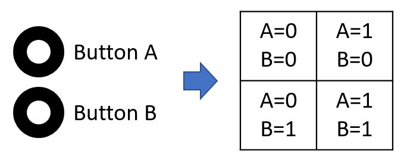
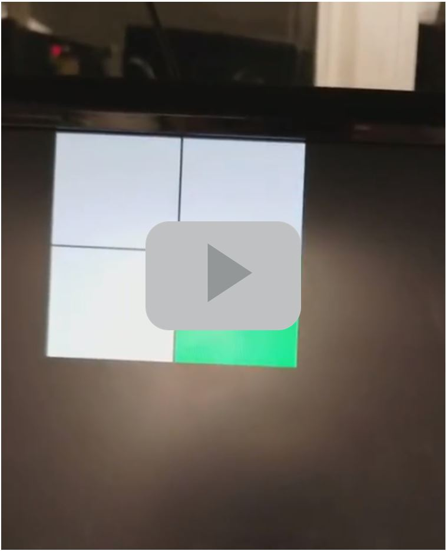
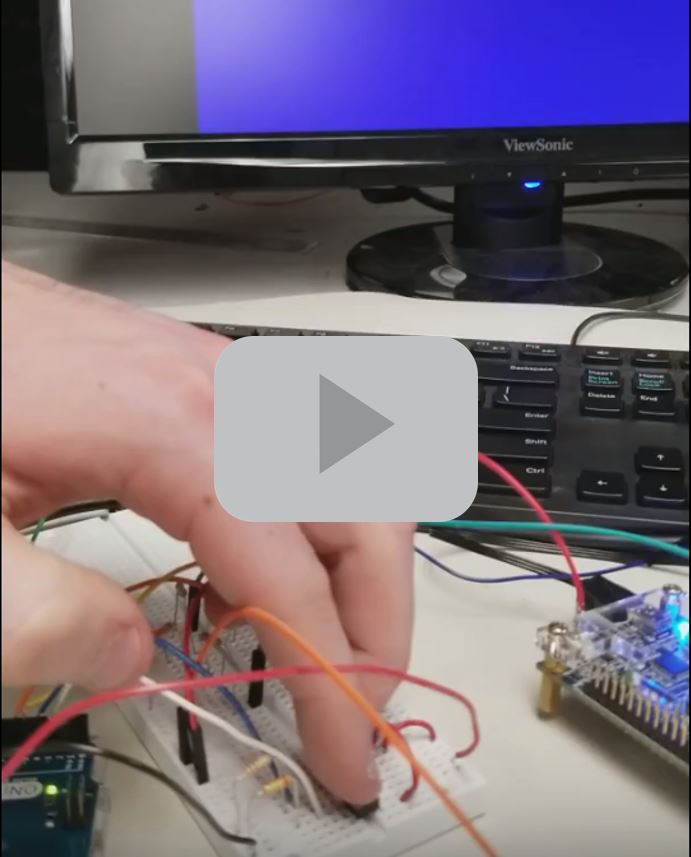

### Graphic
Generating the input signal
First, we wanted to create a 2 by 2 grid on the display. We declared a 2 by 2 array of bits representing the grid, and a wire that connect to the two input on-board button.

```Verilog
//2-by-2 array of bits
reg grid_array [1:0][1:0]; //[rows][columns]
reg grid_ind_x; //Index x into the array
reg grid_ind_y; //Index y into the array
// current highlighted square
wire highlighted_x;
wire highlighted_y;
```

Next, we use a simple state machine that will iterating through the 4 grid cell and set the button input to the corresponding grid cells.


In order to confirm our logic work as expected, we connected four of the LEDs on the FPGA board, each one corresponds to a grid cell.


We decided to connect two toggle switches to the FPGA and show the change in a 2-by-2 grid on the screen. Later, this code can be expanded to display the full maze. The following figure shows an overview of our system:

Team Assignment

First, we declared our 2-by-2 array of bits, and switch 1 to control the x-coordinate and switch 2 to control the y-coordinate of the highlighted square:

[](https://youtu.be/Z5URB4X2w9Q)  

Mapping external inputs to four different outputs on the screen  
[](https://youtu.be/TJx6PqLpqdA)  

