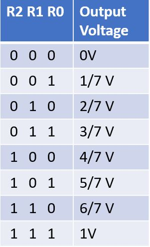

# Lab 3

## Goals:
The goal of the Graphic subteam was to build a FPGA base station that will display a simplified version of the final maze grid by writing a VGA controller. 

The goal of the Acoustic sub team was to use an FPGA to generate first a square wave that should be played on the speaker and then a tune of three different frequencies. The FPGA must be connected to the speakers using an 8-bit DAC. 


## Sub- teams:  
### Graphic
1. JinJie Chen; Adrian; Amanda Pathmanathan
### Acoustic
2. Khyati Sipani; Sanush Nukshan Kehelella; Kenneth Huaman

## Lab Procedure


### Graphic
Generating the input signal
First, we wanted to create a 2 by 2 grid on the display. We declared a 2 by 2 array of bits representing the grid, and a wire that connect to the two input on-board button.  


```Verilog
//2-by-2 array of bits
reg grid_array [1:0][1:0]; //[rows][columns]
reg grid_ind_x; //Index x into the array
reg grid_ind_y; //Index y into the array
// current highlighted square
wire highlighted_x;
wire highlighted_y;
```

Next, we use a simple state machine that will iterating through the 4 grid cell and set the button input to the corresponding grid cells.


Here is the code for the state machine:

```Verilog
always @ (posedge CLOCK_25) begin
	// State 0: Loop through grid
	if (state == 0) begin
	  if (grid_ind_x < 1) begin         //If X-coordinate is 0
		 grid_ind_x <= grid_ind_x + 1;   //X-coordinate = 1
	  end
	  else begin                        //If X-coordinate is 1
		 grid_ind_x <= 0;                //X-coordinate = 0
		 if (grid_ind_y < 1) begin       //If Y-coordinate is 0
			grid_ind_y <= grid_ind_y + 1; //Y-coordinate = 1
		 end
		 else begin                      //else Y-coordinate = 0
			grid_ind_y <= 0;
		 end
	  end
	  state <= 1;                       //Switch to state 1
	end // state 0

	// State 1: If at highlighed coordinates, set grid space to 1, else set to 0
	else if (state == 1) begin
	  if (grid_ind_x == highlighted_x && grid_ind_y == highlighted_y) begin
		 grid_array[grid_ind_y][grid_ind_x] <= 1;
	  end
	  else begin
		 grid_array[grid_ind_y][grid_ind_x] <= 0;
	  end
	  state <= 0;
	end // state 1

	else begin                          //Default
	  state <= state;
	end
end
```

In order to confirm our logic work as expected, we connected four of the LEDs on the FPGA board, each one corresponds to a grid cell.

```Verilog
assign LED[0] = grid_array[0][0];
assign LED[1] = grid_array[0][1];
assign LED[2] = grid_array[1][0];
assign LED[3] = grid_array[1][1];
```
The following code is the set of combinational logic that determine the color of each pixel on the screen. The registers PIXEL_COORD_X and PIXEL_COORD_Y are the output from the VGA driver and the main module will output the color of that pixel.

```Verilog
always @ (*) begin 
  if(PIXEL_COORD_X > 0 && PIXEL_COORD_X <  grid_width && PIXEL_COORD_Y > 0 && PIXEL_COORD_Y < grid_width) begin
		if (grid_array[0][0]) PIXEL_COLOR = green;
		else PIXEL_COLOR = white;
  end
  else if(PIXEL_COORD_X > grid_width && PIXEL_COORD_X <  2*grid_width && PIXEL_COORD_Y > 0 && PIXEL_COORD_Y < grid_width) begin
  	if (grid_array[0][1]) PIXEL_COLOR = green;
		else PIXEL_COLOR = white;
  end
  else if(PIXEL_COORD_X > 0 && PIXEL_COORD_X <  grid_width && PIXEL_COORD_Y > grid_width && PIXEL_COORD_Y < 2*grid_width) begin
		if (grid_array[1][0]) PIXEL_COLOR = green;
		else PIXEL_COLOR = white;
  end
  else if(PIXEL_COORD_X > grid_width && PIXEL_COORD_X <  2*grid_width && PIXEL_COORD_Y > grid_width && PIXEL_COORD_Y < 2*grid_width) begin
  	if (grid_array[1][1]) PIXEL_COLOR = green;
		else PIXEL_COLOR = white;
  end
  else begin
		 PIXEL_COLOR = black;
  end
end
```

Here is a video of the grid display:  

[](https://youtu.be/Z5URB4X2w9Q)  

Next, we want to build a basic base station that have external input to the arduino board and the arduino with communicate with the FPGA using the digital ports on both of these devices. An important note is that the arduino output 5V and the FPGA operate at 3.3V, so we build a voltage divider to adjust the voltage from the arduino to the FPGA.  
We use two external push button as trigger of the message to be transfer from the arduino to the FPGA. Here is the code snippet for the arduino:  
```C
void loop() {
  int value1 = digitalRead(3);
  int value2 = digitalRead(4);
  digitalWrite(5, value1);    // output voltage of pin 3 to pin 5
  digitalWrite(6, value2);    // output voltage of pin 4 to pin 6
  delay(50);     
}
```

The code for the FPGA remains the same from the previous part, but onlt the input of the highlighted_x and highlighted_y is mapped to the 2 GPIO pins we connect to the arduino. 

```Verilog
assign highlighted_y= GPIO_0_D[29];
assign highlighted_x= GPIO_0_D[31];
```

Here is a video of the simple base state:  

[](https://youtu.be/TJx6PqLpqdA)  


#### VGA DAC
The VGA cable connecting to the monitor only has one wire for red, one wire for green, and one wire for blue. These are analog cables (they take values from 0 to 1 V). The VGA connector we use in the lab used a resistor DAC (Digital-to-Analog-Converter) to onverts the 8 given color bits (3 bit for Red, 3 bit for Green, and 2 bit for Blue) at 3.3V form the FPGA to the desired three color 1V analog signals.
Let consider the red signal first. The FPGA output a 3 bit (R0, R1, R2) digital signal for color red at 3.3V and the VGA take a 1V analog signal. The following schematic shows the basic logic behind the DAC for red signal:  

  

The example above use a .5kOhm, 1kOhm, and 2kOhm for the 3 digital output of Red. The value is choosen to be a factor of 2 apart since each bit of the 3 bit output(binary value) is a factor of 2 apart. This allows us to map the 3 digital output to a voltage between 0V to 1V. The following chart shows an approximate mapping:  

  

The value in the chart is bwtween 0-1V, if the 3 digital input also operate at 1V. For the case of our 0V-3.3V output, we will need a simple voltage divider to lower the voltaeg range to 0V-1V.
Here is the schematic with nodes label:

  

By applying kirchhoff's current law, we get that V0 = (4*R2+2*R1+R0)/7


### Acoustic

We used the [DE0-Nano Development Board for this lab](https://www.altera.com/en_US/pdfs/literature/ug/DE0_Nano_User_Manual_v1.9.pdf). The FPGA was programmed using Quartus II software provided Altera. To connect the FPGA to the speaker, we first used the datasheet of the FPGA to do pin assignments. We then connected these pins through an [8 bit DAC](http://www.bourns.com/docs/Product-Datasheets/R2R.pdf) to the speaker. 

We began by implementing the simplest waveform which was a square wave at 400Hz. We used the on-board 50MHz clock which meant that we had to divide down the clock to produce a square wave at the frequency that we wanted. In every cycle, the output should toggle twice as well. Therefore we needed to toggle every 50000000/(400*2) = 62500 cycles. We used a counter to count 62500 and every time the counter reached 62500, we toggled the output and reset the counter. Below is a picture of the wave that we obtained and a snippet of our code:


Here’s what it sounded like:


[Square Wave Tone](https://youtu.be/94oU42XU6r8) 


After the square wave, we tried to implement a sawtooth wave, a triangle wave and a sine wave. The output for these waves was 8 bits since we used an 8-bit DAC. For the sawtooth wave, we wanted a frequency of around 400Hz. Again we used the onboard clock of 50MHz. We wanted the wave to gradually increase from 0 to 255 and then reset back to 0. To implement this, we needed to increment the output by 1 every 50000000/(400*256) = 490 cycles. So we used a counter for this which incremented every clock cycle. When it reached 490, the output was incremented by one and the counter was reset. This is the waveform that we created along with a snippet of our code:


For the triangle wave, we wanted the output to gradually increase and then gradually decrease back to zero. We used the same counter as before, but this time we had a variable, “dec”, that indicated whether to increment or decrement the output. We used some additional logic to decide whether this variable should be set or reset. Here’s the waveform for the triangle wave and a snippet of our code:


And it sounded like:


[Triangle Wave Tone](https://youtu.be/lnJT9_dF2mI) 


We used a ROM table for the sine wave generation. We used the following MATLAB code to generate the values that would be loaded on to the ROM:


To generate a sine wave of 10kHz, we needed 5000 values in the ROM table and we had a counter that incremented by one until it reached 4999 that was used as the address for reading out of the ROM. The following wave was generated using the code shown:


Finally, we generated 3 sine waves at different frequencies, to generate a short tune. For this, we used the same ROM table as before, but used an additional counter to delay the incrementing of the address to reduce the frequency of our sine wave. We wanted lower frequencies so that the tune can be heard easily. For example to generate a wave of 769Hz, the ROM address was incremented every 50000000/(5000*769) = 13 cycles as shown below:


In our top level file, we instantiated three modules which corresponded to three different wave frequencies. We wanted the output frequency to change every 1 second, so we had a counter up to 50000000. Each time the counter reached 50000000, we used a multiplexer to change the frequency of the output wave. This was done as shown in the following snippet of code:


Oscilloscope demo:

[Oscilloscope Demo of the three frequencies](https://youtu.be/K7GxZWxUlo4)


How it sounds:

[Three Frequency Tone](https://youtu.be/ol8nvzl8iOY)
