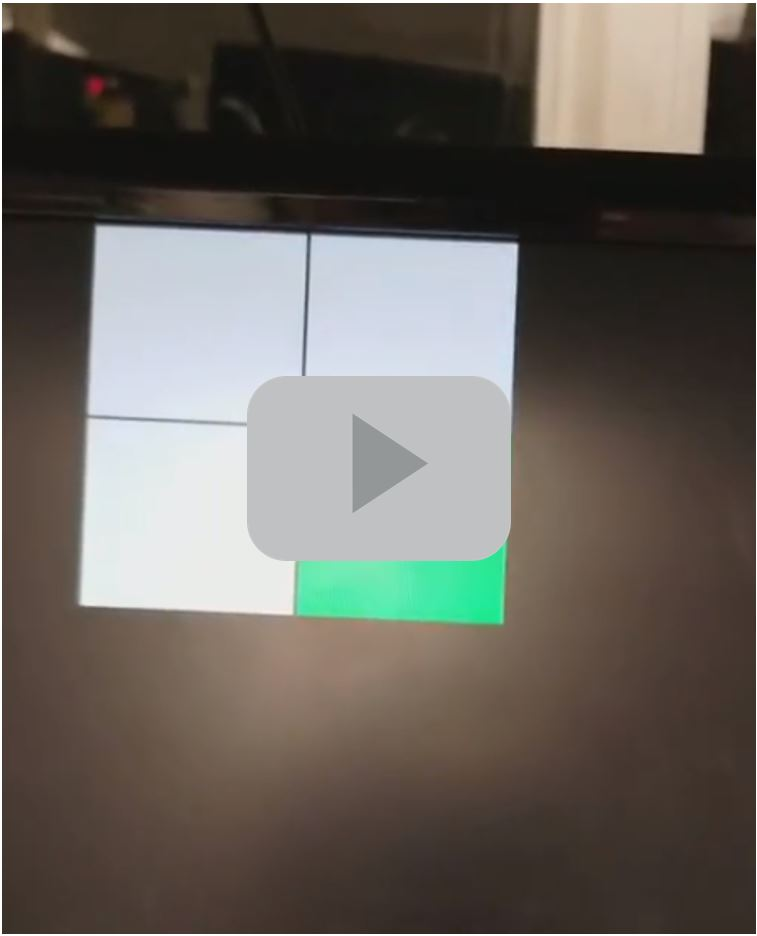
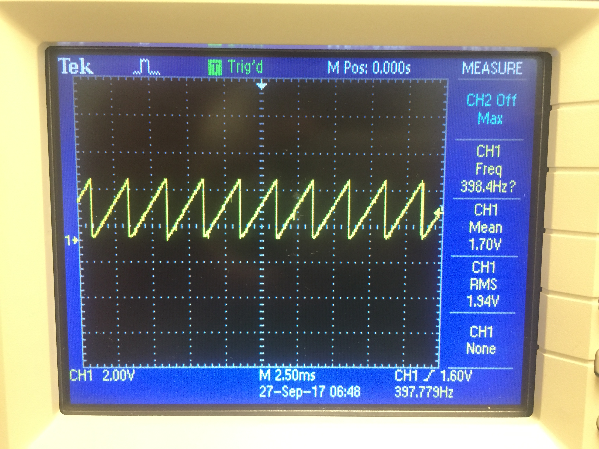
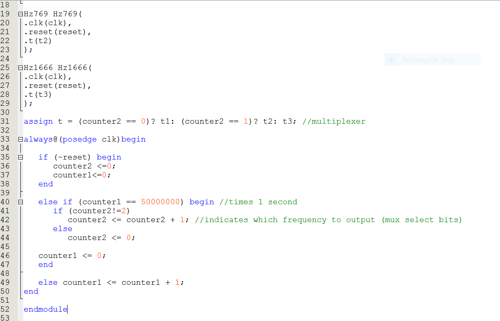

# Lab 3

## Goals:
The goal of the Graphic subteam was to build a FPGA base station that will display a simplified version of the final maze grid by writing a VGA controller. 

The goal of the Acoustic sub team was to use an FPGA to generate first a square wave that should be played on the speaker and then a tune of three different frequencies. The FPGA must be connected to the speakers using an 8-bit DAC. 

## Sub- teams:  
### Graphic
1. JinJie Chen; Adrian Higgins Dohmann; Amanda Pathmanathan
### Acoustic
2. Khyati Sipani; Sanush Nukshan Kehelella; Kenneth Huaman

## Lab Procedure

### Graphic
Generating the input signal
First, we wanted to create a 2 by 2 grid output on the display. We declared a 2 by 2 array of bits represetn the state of the grid, and  the highlighted_x and  square:

We decided to connect two toggle switches to the FPGA and show the change in a 2-by-2 grid on the screen. Later, this code can be expanded to display the full maze. The following figure shows an overview of our system:

Team Assignment

First, we declared our 2-by-2 array of bits, and switch 1 to control the x-coordinate and switch 2 to control the y-coordinate of the highlighted square:

  

Mapping external inputs to four different outputs on the screen  
  

### Acoustic

We used the [DE0-Nano Development Board for this lab](https://www.altera.com/en_US/pdfs/literature/ug/DE0_Nano_User_Manual_v1.9.pdf). The FPGA was programmed using Quartus II software provided Altera. To connect the FPGA to the speaker, we first used the datasheet of the FPGA to do pin assignments. We then connected these pins through an [8 bit DAC](http://www.bourns.com/docs/Product-Datasheets/R2R.pdf) to the speaker. 

We began by implementing the simplest waveform which was a square wave at 400Hz. We used the on-board 50MHz clock which meant that we had to divide down the clock to produce a square wave at the frequency that we wanted. In every cycle, the output should toggle twice as well. Therefore we needed to toggle every 50000000/(400*2) = 62500 cycles. We used a counter to count 62500 and every time the counter reached 62500, we toggled the output and reset the counter. Below is a picture of the wave that we obtained and a snippet of our code:

Here’s what it sounded like:

[Square Wave Tone](https://youtu.be/94oU42XU6r8) 

After the square wave, we tried to implement a sawtooth wave, a triangle wave and a sine wave. The output for these waves was 8 bits since we used an 8-bit DAC. For the sawtooth wave, we wanted a frequency of around 400Hz. Again we used the onboard clock of 50MHz. We wanted the wave to gradually increase from 0 to 255 and then reset back to 0. To implement this, we needed to increment the output by 1 every 50000000/(400*256) = 490 cycles. So we used a counter for this which incremented every clock cycle. When it reached 490, the output was incremented by one and the counter was reset. This is the waveform that we created along with a snippet of our code:

For the triangle wave, we wanted the output to gradually increase and then gradually decrease back to zero. We used the same counter as before, but this time we had a variable, “dec”, that indicated whether to increment or decrement the output. We used some additional logic to decide whether this variable should be set or reset. Here’s the waveform for the triangle wave and a snippet of our code:

And it sounded like:

[Triangle Wave Tone](https://youtu.be/lnJT9_dF2mI) 

We used a ROM table for the sine wave generation. We used the following MATLAB code to generate the values that would be loaded on to the ROM:

To generate a sine wave of 10kHz, we needed 5000 values in the ROM table and we had a counter that incremented by one until it reached 4999 that was used as the address for reading out of the ROM. The following wave was generated using the code shown:

Finally, we generated 3 sine waves at different frequencies, to generate a short tune. For this, we used the same ROM table as before, but used an additional counter to delay the incrementing of the address to reduce the frequency of our sine wave. We wanted lower frequencies so that the tune can be heard easily. For example to generate a wave of 769Hz, the ROM address was incremented every 50000000/(5000*769) = 13 cycles as shown below:

In our top level file, we instantiated three modules which corresponded to three different wave frequencies. We wanted the output frequency to change every 1 second, so we had a counter up to 50000000. Each time the counter reached 50000000, we used a multiplexer to change the frequency of the output wave. This was done as shown in the following snippet of code:

Oscilloscope demo:

[Oscilloscope Demo of the three frequencies](https://youtu.be/K7GxZWxUlo4)

How it sounds:

[Three Frequency Tone](https://youtu.be/ol8nvzl8iOY)
