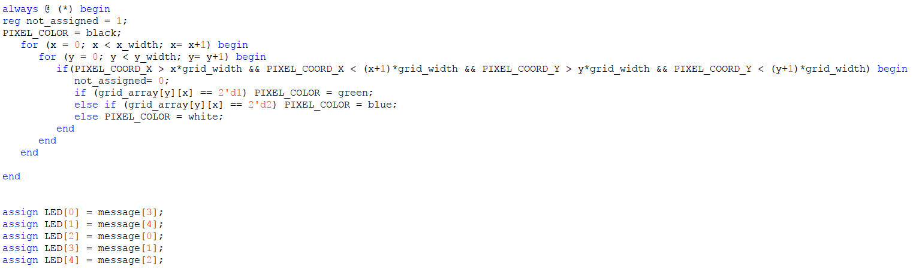
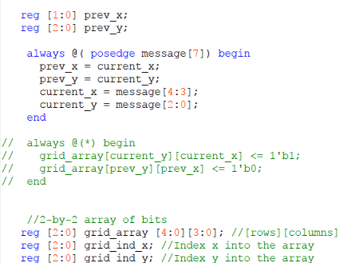
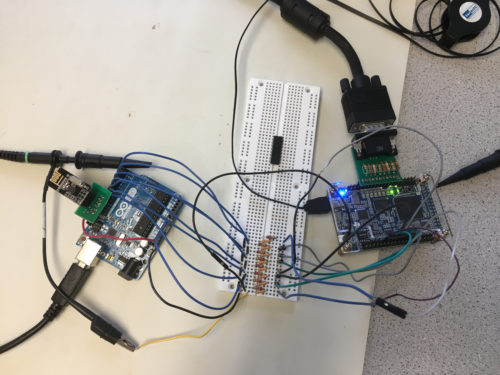
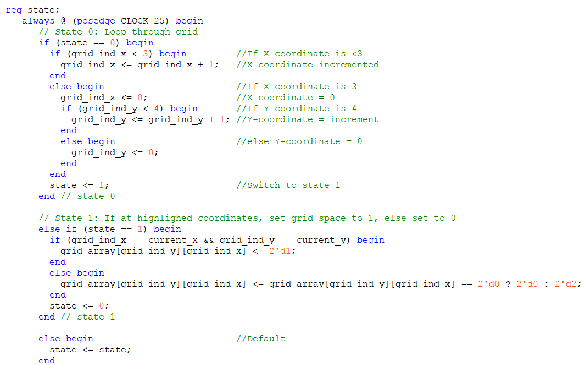
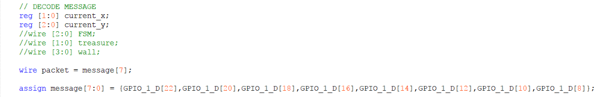
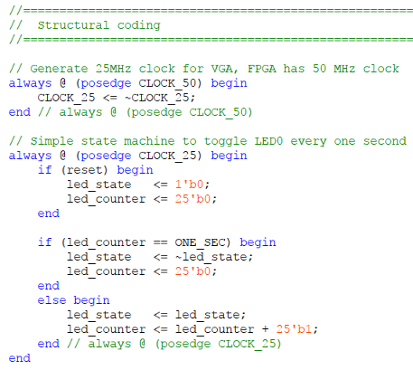
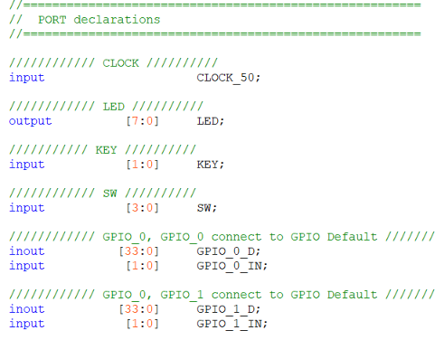
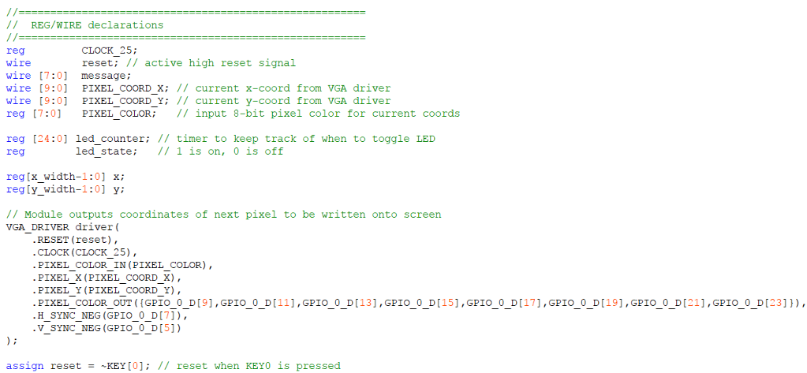

### Lab 4

## Goals

## Subteams

### Radio Team
- Adrian Higgins Dohmann, Amanda Pathmanathan, JinJie Chen
### FPGA Team
- Sanush Nukshan, Khyati Sipani, Kenneth Huaman
## Procedure
### Radio
After downloading the radio library and having it installed with the Arduino IDE, we had more than one computer at our disposal, so we connected the transmitting and receiving ends of radio communication to two different laptops:

We calculated our identifier using this formula: 2*(3D + N) + X
We are the Monday night lab (D=1), Team 7 (N=7)
so 2*(3(1)+7)+0= 20 and  2*(3(1)+7)+1= 21 (both in decimal) 
In hex they are: 14 and 15
const uint64_tpipes[2]= (0x0000000014LL, 0x0000000015LL)

The Maze Array: 
We open the serial monitor and type in "T", which starts Transmit Mode. 

The transmitter will begin sending:
unsigned char maze[5][5] =
{
0, 0, 0, 0, 0,
0, 0, 0, 0, 0,
0, 0, 0, 0, 0,
0, 0, 0, 0, 0,
0, 0, 0, 0, 0,
};

The receiver should be getting a maze and when we start iterating through the maze, the maze should continue to update at the receiving end. It increments each element in the array by 1 and goes through all y coordinates(rows) first before moving to the next x coordinate (column). This is demonstrated in the video below: 

//video of transmitter and receiver -- the timestamps and iterating maze array

### FPGA

For this subsection of the lab, the main component was the DE0 Nano FPGA. It was connected to the Computer Monitor at the lab station via a VGA cable. Later on, both sections were combined when the Arduino from the Radio Subteam was connected to practice communication between the boards.
Starting off from the work of the FPGA subteam of lab 3 last week, the Verilog code was first optimized to work off of two nested for loops. 

The code was then modified to display the 5x4 grid by extending the iterations through the loop. The grid, like last week, was composed of white tiles amongst a black background. At a certain grid location determined by current_x and current_y, the tile would turn green. An additional consideration to implemenent a way to keep track of visited tile, is to note the previous current_x and current_y as prev_x and prev_y respectively, and turn the tile at that old location blue. Some of the declarations can be seen below, and 'message[7] will be explained later as well.

The code had to be modified additionally to take in the input from an arduino. Our team decided to use parallel communication for the sake of this lab, with the information being sent in two packets. 

A state machine was used for this lab, as seen below:

The input from the arduino would give a current x and y position. 
At those coordinates the tile would temporaily be turned green.
//mention code that shows iput,
\\ show video of the grid parsing through the x and y coordinates

