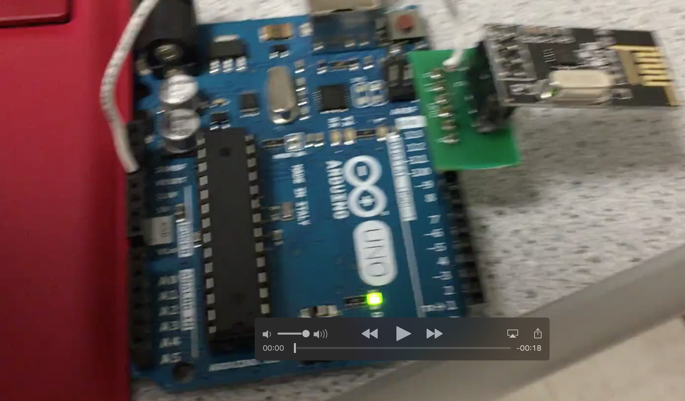
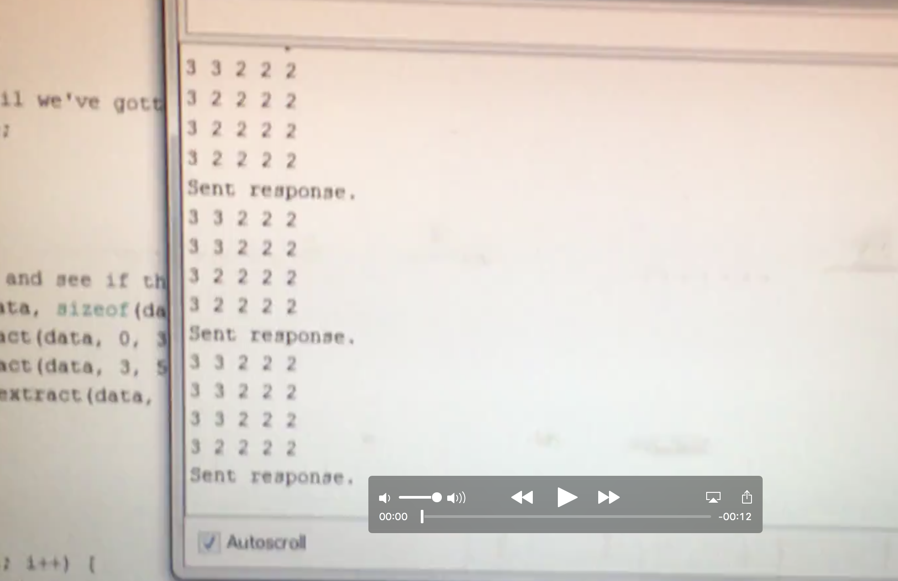
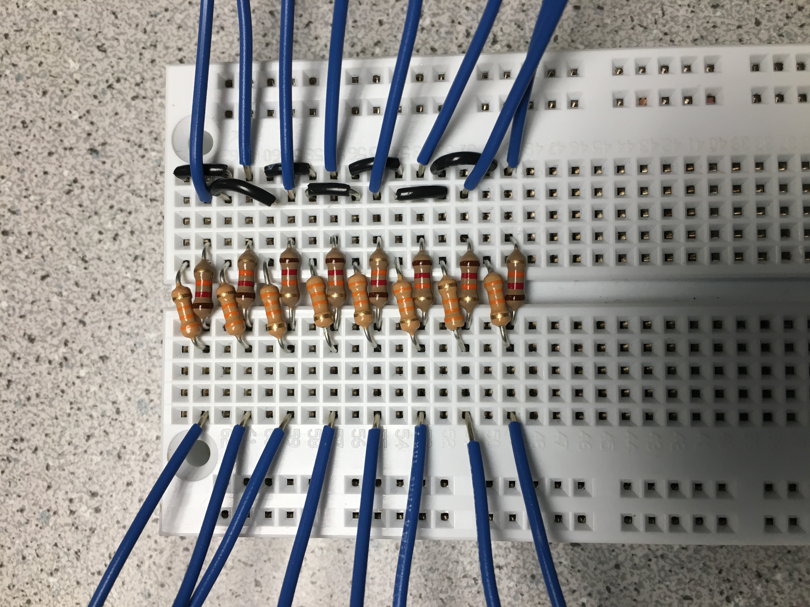
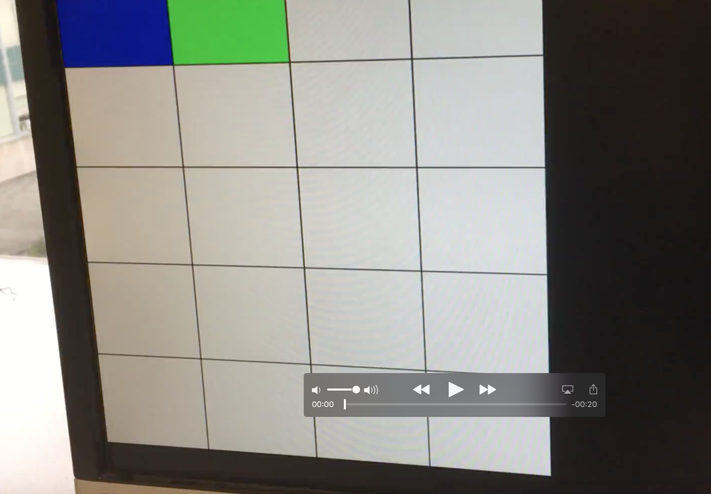

### Lab 4

## Goals

## Subteams

### Radio Team
- Adrian Higgins Dohmann, Amanda Pathmanathan, JinJie Chen  
### FPGA Team
- Sanush Nukshan, Khyati Sipani, Kenneth Huaman

## Procedure
### Radio
After downloading the radio library and having it installed with the Arduino IDE, we had more than one computer at our disposal, so we connected the transmitting and receiving ends of radio communication to two different laptops:

We calculated our identifier using this formula: 2*(3D + N) + X
We are the Monday night lab (D=1), Team 7 (N=7)
so 2*(3(1)+7)+0= 20 and  2*(3(1)+7)+1= 21 (both in decimal) 
In hex they are: 14 and 15
const uint64_tpipes[2]= (0x0000000014LL, 0x0000000015LL)

The Maze Array: 
We open the serial monitor and type in "T", which starts Transmit Mode. 

The transmitter will begin sending:

```Arduino
unsigned char maze[5][5] =
{
0, 0, 0, 0, 0,
0, 0, 0, 0, 0,
0, 0, 0, 0, 0,
0, 0, 0, 0, 0,
0, 0, 0, 0, 0,
};
```

The receiver should be getting a maze and when we start iterating through the maze, the maze should continue to update at the receiving end. It increments each element in the array by 1 and goes through all y coordinates(rows) first before moving to the next x coordinate (column). This is demonstrated in the video below: 
[](https://youtu.be/KNLFmP_W6XA)


This video demonstrates the arduino code iterating through the maze array, and the updated maze begin displayed on the receiver end:
[](https://youtu.be/_CwknqWVh10)


This is a picture of our design for the voltage divider-- digital pins 2-8 and A0 are all outputs 
bit 2 is the LSB (least significant bit) and 8 is the MSB (most significant bit):



A video of the final maze on the computer monitor can be seen at the bottom of the FPGA section. There, white is unexplored areas, blue is explored, and green is the current location of the robot:


### FPGA


For this subsection of the lab, the main component was the DE0 Nano FPGA. It was connected to the Computer Monitor at the lab station via a VGA cable. Later on, both sections were combined when the Arduino from the Radio Subteam was connected to practice communication between the boards.
Starting off from the work of the FPGA subteam of lab 3 last week, the Verilog code was first optimized to work off of two nested for loops. 


The code was then modified to display the 5x4 grid by extending the iterations through the loop. The grid, like last week, was composed of white tiles amongst a black background. At a certain grid location determined by current_x and current_y, the tile would turn green. The tiles that have already been visited are tracked by changing the value help in their grid location to a 2 if it is both not highlighted and not visited. Some of the declarations can be seen below, and "message[7]" will be explained later as well.

 

Furthermore, the logic behind how the grid color would transition was also changed, and the suggestion from lab 3 of using a state machine was used in this implementation. The applicable code segment that was used for this lab is seen below:


For the aforementioned interaction with the radio on the sending Arduino, the code had to be modified additionally to take in the input from a receiving arduino. Our team decided to use parallel communication for the sake of this lab, with the information being sent in two packets. As mentioned above, message[7] is the wire which denotes the packet currently being sent. A voltage divider bridge had to be wired up to connect the receiving Arduino and the FPGA, since the Arduino outputs 5V and the FPGA takes in 3.3V. The hardware setup can be seen below:


The input from the receiving Arduino was called message, which was a 8 bit wire directly connected to 8 of the GPIO-1 pins on the FPGA. The logic can be seen below.


The input from the receiving arduino would give a current_x and current_y position as determined by the sending arduino. The sending Arduino was set to cycle through all the squares in the grid. At the corresponding coordinates the tile would temporaily be turned green, and the previous pair of coordinates would turn blue.


[](https://youtu.be/DG-bNLUZ5qI)
