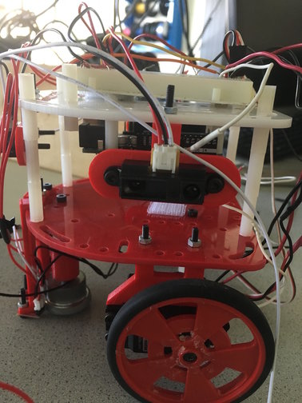
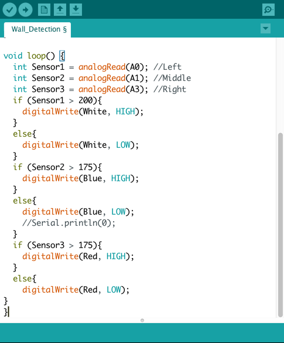
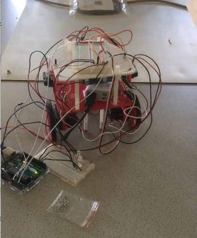

## Milestone 2
### Goal
The purpose of this milestone was to utilize the photoresistor circuit to detect three distinct frequencies of IR LED pulses and to calibrate the IR sensor to perform wall detection.
### Lab Procedure

#### Treasure Detetection
To accomplish to goal of identifying different frequencies, it was decided that a visual cue in the form of an LED would work nicely. The code from lab2 was modified slightly to drive the following cicuit.

The basic algorithm was kept from open music labs, but the number of bins was reduced to save on data usage.

The demonstration of the capabilities of the Treasure Detection subsystem can be seen in the following video.

As opposed to the test during lab 2, the treasure was held at a distance of 8 cm, which seems to be around the maximum range of detection.

#### Wall Detection

We used [distance sensors](https://www.sparkfun.com/products/12728) to help detect walls. We first tested the distance sensors using our Arduino to figure out how they work and to test whether they were functioning correctly. Then we mounted them to the front, left, and right side of our robot. The image below shows how we mounted the left wall sensor:

We set up three different colored LEDS - red, white, and blue - to correspond to the different wall sensors we had mounted. We measured a point from the center of a square on the grid to a black line, which was 7.5 cm. Then, we determined a threshold of 200 for wall detection by measuring the value read by the wall sensor if the wall was 7.5 cm away from the robot.  The LED would go high if it detected a wall (i.e the wall sensor value was above 200), and low if it did not. Below is the code we programmed our Arduino with:

Here is a video of the robot with all the LEDs integrated, detecting walls:

With all these additional wires, we figured our robot needs a rewiring job! We plan to work on this next week.
