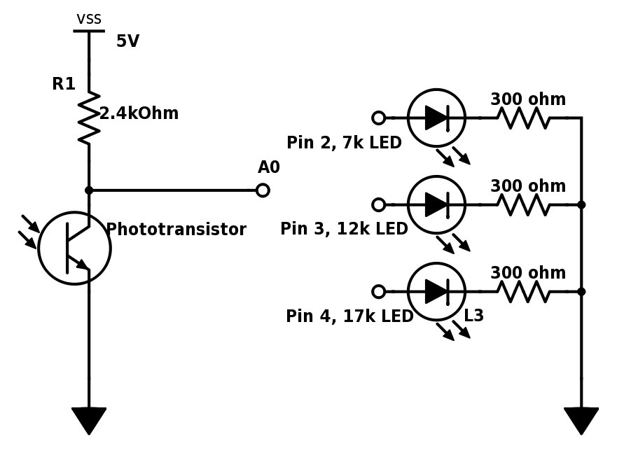
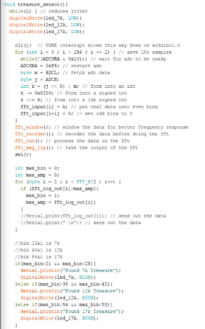
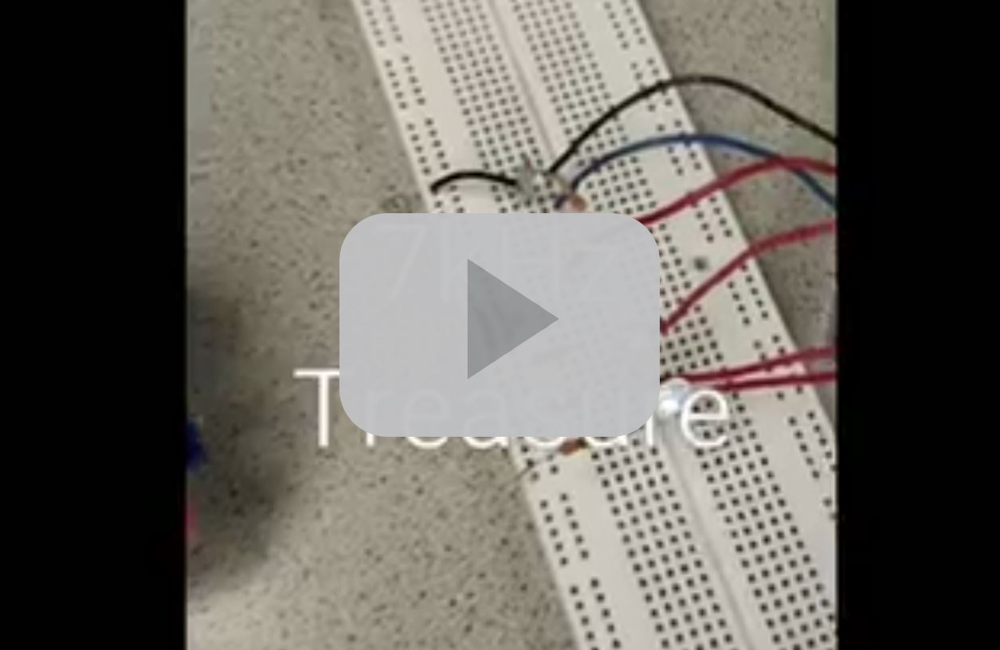

## Milestone 2
### Goal
The purpose of this milestone was to utilize the photoresistor circuit to detect three distinct frequencies of IR LED pulses and to calibrate the IR sensor to perform wall detection.
### Lab Procedure

#### Treasure Detetction
To accomplish to goal of identifying different frequencies, it was decided that a visual cue in the form of an LED would work nicely. The code from lab2 was modified slightly to drive the following cicuit.

The basic algorithm was kept from open music labs, but the number of bins was reduced to save on data usage.

The demonstration of the capabilities of the Treasure Detection subsystem can be seen in the following video.

As opposed to the test during lab 2, the treasure was held at a distance of 8 cm, which seems to be around the maximum range of detection.

#### Wall Detection
