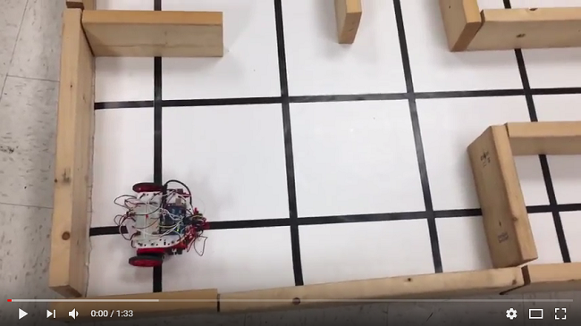

# Milestone 3
By Sanush Nukshan, Khyati Sipani, Kenneth Huaman, Adrian Dohmann, Amanda Pathmanathan, JinJie Chen

## Goal
The goals of this milestone were as follows:
1) create a tool to simulate maze exploration for easily testing the performance of algorithms
2) implement maze exploration on our actual robot

## Lab Procedure
### Simulation
We decided to create our simulation within Matlab both because our group members were already somewhat famililar with Matlab coding and because we already had access to a Team Alpha's GUI implementation. The display portion of our maze representation is based on Team Alpha's, though we saw fit to add additional functionality, such as direction tracking, node numbering, and tracking discovered connections between nodes.

In order to display the maze, we used [Team Alpha's basic GUI implementation](https://cei-lab.github.io/ECE3400-2017-teamAlpha/milestone3.html), namely the ideas held in the first two code blocks on the linked page. All credit to Team Alpha for this GUI implementation. Because that portion of our implementation was not written by us and is very well explained on Team Alpha's page, we will not go into detail about it here.

In order to track the current position in the maze, we created variables *curr_x*, *curr_y*, and *curr_dir*, initialized to the starting position of the robot before the loop begins. The variable *steps* is increased by one each iteration of the algorithm, allowing us to count the total number of steps taken to expore the maze. The Nx3 array *segments* is used to track the discovered segments between nodes. Each iteration, we look at the walls surrounding the current node and add the segment connecting the current node to its N/S/E/W neighbors if there is no wall between the two. Then the algorithm is able to determine which node should be moved to next, updating the variables *next_x* and *next_y*. If the algorithm detects that the maze has been fully explored, it should break from the while loop to conclude the simulation. After the algorithm has determined the next move, the current position, current direction, and new state of the maze are updated before the maze is redrawn. When the algorithm determines that the entire maze has been explored and broken the while block, a line is printed in the console indicating that exploration has finished and displaying the number of steps taken.
```matlab
% Total number of steps taken
steps = 0;
% Current postion of the robot
curr_x= 4;
curr_y= 5;
% Direction the robot is currently facing
% Can be N,S,E,W
curr_dir= 'N';
% Segment array holds information about all discovered node connections
% Each row holds information for one segment in format:
% [segmentID nodeAID nodeB], where nodeB and nodeA are the node IDs
% corresponding to the two connected nodes, with nodeB > nodeA
segments = [];

while (true)
    
    % Visit next pos and  mark it as visited, intialized to 0 so that we get an error if we
    % fail to move
    next_x= 0;
    next_y= 0;
    % Update node ID to current position
    ID= getNodeID(curr_x,curr_y);
    
    % Get wall information at current location
    wall_bin = de2bi(wall_loc(curr_y,curr_x), 4, 'right-msb');
    % Add segments connecting to all adjacent nodes
    if (wall_bin(1) == 0) %North neighbor
        segments= addSegment(segments,ID,getNodeID(curr_x,curr_y-1));
    end
    if (wall_bin(2) == 0) %South neighbor
        segments= addSegment(segments,ID,getNodeID(curr_x,curr_y+1));
    end
    if (wall_bin(3) == 0) %East neighbor
        segments= addSegment(segments,ID,getNodeID(curr_x+1,curr_y));
    end
    if (wall_bin(4) == 0) %West neighbor
        segments= addSegment(segments,ID,getNodeID(curr_x-1,curr_y));
    end
    
%======================
%    Algorithm to determine next movement here.
%    
%    Must set next_x and next_y to the next desired locations.
%
%    Must break if the maze is fully explored.
%======================
    
    % Update our position
    prev_y = curr_y;
    prev_x = curr_x;
    curr_y = next_y;
    curr_x = next_x;
    
    % Update our direction based on how we've changed our position
    if (curr_x > prev_x)
        curr_dir= 'E';
    elseif (curr_x < prev_x)
        curr_dir= 'W';
    elseif (curr_y < prev_y)
        curr_dir= 'N';
    else %(curr_y > prev_y)
        curr_dir= 'S';
    end
    
    % We've made a movement, add a step
    steps = steps + 1;
    
    % Update maze array
    curr_loc(curr_y, curr_x) = 0;
    curr_loc(prev_y, prev_x) = 0.5;
    
    pause(0.2);
    
    %Update drawing of the maze
    imagesc(curr_loc);
    caxis([0 1]); % Re-scale colormap to original scale
    draw_walls(wall_loc);
end
display(horzcat('The maze was successfully explored in ',num2str(steps),' steps.'));
```
For the sake of being able to keep track of all the possible nodes and segments and to avoid adding duplicate segments, two separate functions were created to uniquely generate ID numbers for segments and nodes. These functions use the following formulas to determine each node's and segment's ID number:
```
nodeID= y + 5*(x-1);
segmentID= 2*nodeA-sign(nodeB-nodeA-1); %(nodeA < nodeB)
```
Conveniently, because of linear indexing in Matlab, the node IDs can be used to index to their corresponding node in the *curr_loc* and *wall_loc* matrices. These formulas allow for a maximum node ID of 20 and a maximum segment ID of 38, which will be convenient for preallocating the necessary data when transitioning to Arduino code.

We wished to navigate our maze using a form of Dijkstra's algorithm. The idea is that, for each iteration of the algorithm, we move to the nearest unexplored node of the maze until we can no longer reach any unexplored nodes. Luckily, there are many, many Matlab implementations of Dijkstra's algorithm already available for free use online. Because we are only trying to test the effectiveness of this method, we feel it appropriate to use whatever tools are available; if we decide later that this algorithm is the most effective for our purposes, we can write our own implementation of Dijkstra's algorithm fairly easily. In the mean time, we decided to use [this implementation by Joseph Kirk](https://www.mathworks.com/matlabcentral/fileexchange/12850-dijkstra-s-shortest-path-algorithm) (which allows for free use, modification, and redistribution), because its required inputs closely fit the data that our simulation already generates. We made a slight modification to this implementation to make it accept our *curr_loc* array as an input and return the shortest discovered path to any so far unexplored node. We implemented this by adding the following into the algorithm section of our simulation and by initializing and declaring an empty matrix *path* before our while loop:
```matlab
if(isempty(path)) 
    % We've finished our most recent path, get the new
    % shortest path to the next unvisited node.
    path= dijkstra(nodes, segments, ID, curr_loc);
end

if (~isempty(path))
    % We still have somewhere to move, do it
    [next_x,next_y]= getNodeCoords(path(1));
    path= path(2:end);
else
    % We have nowhere left to go, end the search
    break
end
```
Running our Matlab script, we can see the following behavior:
[](https://youtu.be/wQSrGs_79XQ)

Clearly, the algorithm needs to be optimized to take into consideration direction and other potential factors (such as proximity to the center of the maze or if a specific node is only explorable from the current node) when deciding between two unexplored spaces that are the same distance. Such optimization will come later, but this search method does work everytime in the mean time.

### Actual Maze Exploration
Implementing maze exploration in our robot was fairly simple. We were able to use our movement code from Milestone 1, so maze exploration only required the addition of tracking direction and position. Because array indexing starts at 0 in C, we found it beneficial to create a new method of mapping coordinates to node IDs and node IDs to segment IDs. We used the following relation:
```C
NodeID= 4 * y + x;
x= NodeID % 4;
y= NodeID / 4;

SegmentID= 2 * nodeA + (nodeB - nodeA - 1 > 0);
```
With this mapping for segment IDs, segment numbers can range from 0 to 36, which is important to know for preallocating data. We additionally require 20 booleans to track which nodes have been visited. In order to save memory, we chose to encode one value per bit with bitwise encodings. This allowed the visited nodes and discovered segments to be stored in only 3 and 5 bytes, respectively. We then created methods to read and write values based on IDs so that these bitwise operations could be abstracted when writing code later. We store our current position and direction each in an unsigned character. The position simply holds the ID of our current node. The direction is coded with 1, 2, 4, 8 representing North, East, South, West. With this encoding, direction can easily be operated on using bitwise operations. 

In order to simplify algorithm writing, we created a method *update_maze()* that can be called upon arrival in any unexplored node for the first time to perform operations such as marking the node as visited, detecting walls, and marking segments connecting to neighboring nodes as discovered if there is no wall blocking the two. When code is further merged to allow for treasure detection and transmitting node information to the base station, these operations can be performed from this method as well. We additionally created a method *move(from_pos, to_pos)* that will move the robot to any given neighboring node. It simply looks to find which direction the desired node is and, if necessary, makes an appropriate turns to face in that direction. It then moves forward one grid space and sets its current direction to be the direction that it has just moved. Because we will always wish to detect walls at a new node, *move* finally calls *update_maze()*.

Using the methods *update_maze()* and *move(from_pos, to_pos)*, we are able to largely abstract considerations of the physical maze within the algorithm. The algorithm simply needs to select which node it would wish to move to, call *move* to that method, and repeat until it has determined that it has finished maze exploration. This makes it exceptionally quick and easy to write an exploration algorithm within this structure or to make changes to our current algorithm without worry of breaking other functionality of our robot.

In moving our search algorithm from the MATLAB simulation to C, we found it worthwhile to write our own implementation of Dijkstra's shortest path algorithm because we found none online that fit our already existing data structures particularly well. In writing our own, we were able to closely limit the size of objects to exactly the maximum that may be need within our 5x4 maze, in order to optimize data usage. We took advantage of the fact that no two nodes in the maze can be farther than 20 moves apart. The final algorithm ended up with a much lower memory consumption than expected, requiring a maximum of only 65 bytes of dynamic memory, excluding the already existing global variables. 

To indicate when the maze has been fully explored, we installed an LED on the top of the robot. When the algorithm determines that it has fully completed exploration, it sets a boolean global variable *done* to true, turns on the LED, and breaks from the while loop that it is running in. The robot will then wait with the LED on until reset.

The robot can be seen navigating the maze in the video below:
[](https://youtu.be/TEWaeKLliJ4)

Clearly, we must still make a few improvements if we wish to win the competition. We need to modify our Dijkstra implementation to take turn time into account when determining the cost of each node. We need to increase the physical speed of the robot, either through larger wheels, some sort of gearbox, or new motors. These are problems for the future.
