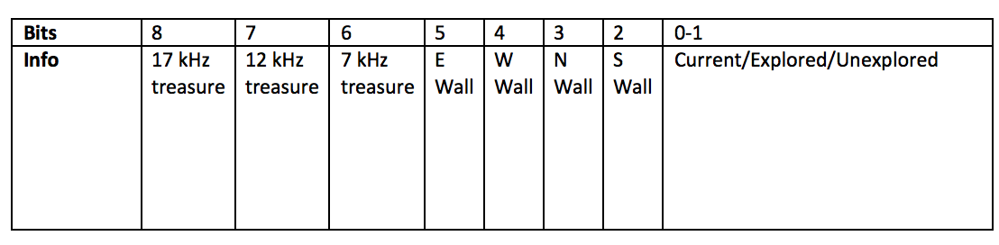
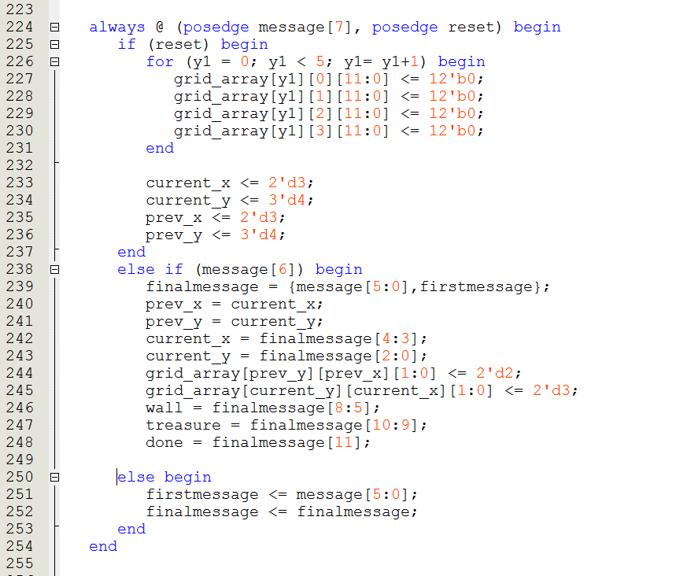
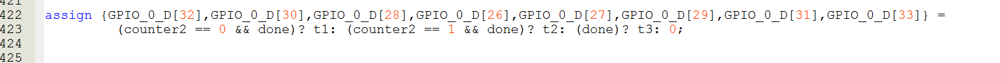
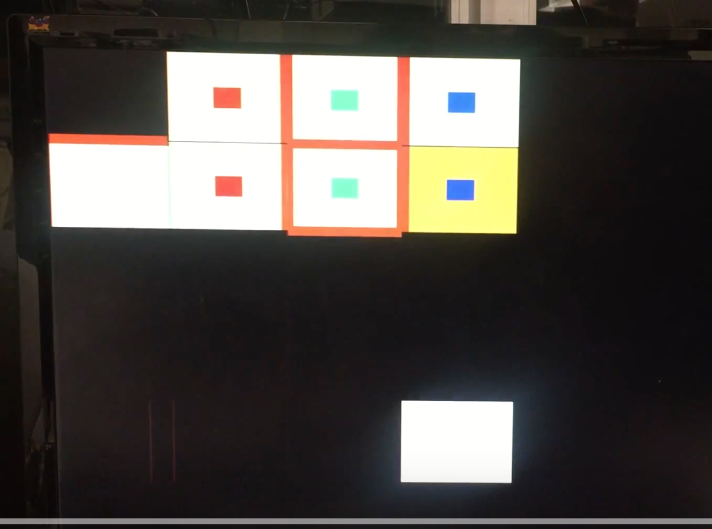
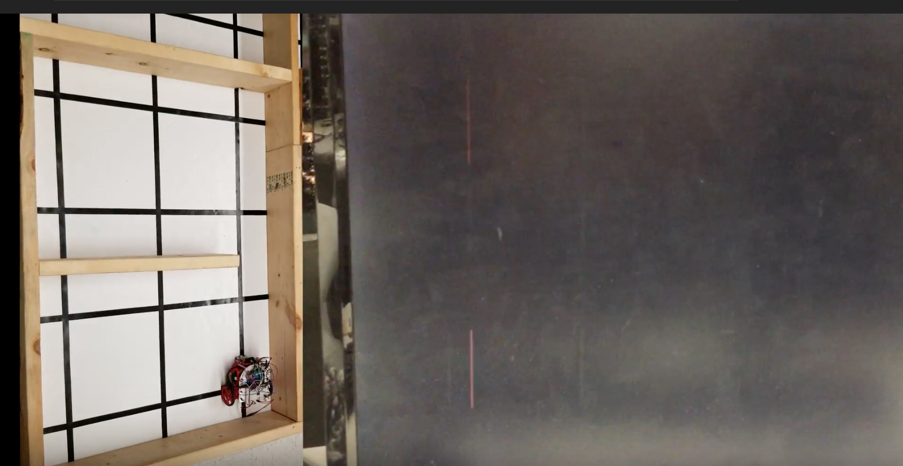

# Milestone 4
By Sanush Nukshan, Khyati Sipani, Kenneth Huaman, Adrian Dohmann, Amanda Pathmanathan, JinJie Chen

## Goal
The goals of this milestone were to have the robot completely map the maze. To do this, we must display exlored and unexplored spaces, walls, treasure, and when exploration is done.

## Lab Procedure
### FPGA

For Milestone 4, we had to incorporate all the blocks from the previous labs and milestones and assemble them into a fully functioning robot. In particular, the FPGA team had to merge the display system and sound system so that the messages received from the robot can be correctly decoded to indicate in addition to the explored, unexplored and current locations, the walls, treasure information and “done”. 

On the FPGA, we saved all the information about all the cells in a 3D array called “grid_array” which stored 12 bits of information for every location given by (x,y). Here is a break-down of what grid array stores:




Since we were using parallel communication, we used 8 pins from the base station Arduino to the FPGA and these were assigned to a 8 bit “message” bus. The MSB of "message", which was generated by the base station Arduino acted as the clock. Every positive edge, indicated that all the other bits have been correctly updated and are ready to be decoded. Hence, we used the posedge of message[7] to enter the always block. However, since we wanted to be able to reset the display even if we weren’t receiving a message, we made reset asynchronous by including it in the sensitivity list in addition to message[7].  In the always block, on reset we set all the 12 bits of every location to zero since they haven’t been explored yet by default. The current and previous locations were set to (4,5) since this was the starting position. We then checked message[6] which indicated which packet was being sent (We needed 12 bits to encode all the information). Based on which packet was being sent, we compiled our final message. Once the full message was received, we updated the previous location and current location and then decoded the message to information about the walls and treasure of the current location. 



We also updated grid_array by setting bits according to if there were walls or treasures. While updating information about walls for the current location we also updated wall information for the neighboring locations since for example if the current location has a North Wall then the location the North of the current location would have a South Wall by default. 


We finally made a simple edit to the acoustic code from lab 3 which simply waited for the done signal until it started outputting the tune to the DAC.  



As for coloring the grid, we worked off our implementation of the display from Lab 4. We have two for loops looping through all combinations of x and y, and if PIXEL_COORD_X and PIXEL_COORD_Y are in the cell the loops are currently in, then we color them either orange, yellow, purple or black depending on the information encoded in grid array. The last two bits of grid array indicate if a cell is current, explored, or unexplored, and the MSB of grid array indicates if our robot is done mapping the maze. Based on these values, the corresponding cell is assigned a color: the current cell is colored orange, an explored cell is colored yellow, an unexplored cell is colored black, and the current cell if the robot is done mapping is colored purple.

Once we are done coloring entire cells, we set a register called colorstate to value 1 so that we can now move on to coloring walls. Colorstate is used to make that the simultaneous coloring of the walls and treasures happens after the coloring of the cell background, so that they are not overwritten. Once color state is one, and if PIXEL_COORD_X and PIXEL_COORD_Y lie where a North wall might be (where North is fixed with respect to the grid), we check to see if the grid array for that particular cell contains any walls. If so, we color a wall of width of 10 pixels brown. We do the same for all other directions: South, East, West.

As for treasures, we color the center of a cell either red, green, or blue if grid array indicates the presence of a treasure. Red is for the 7 kHz treasure, Green is for the 12 kHz, and blue is for the 17 kHz.

Below is a snippet of our code for the coloring of the cell background and the South Wall:

```Verilog
always @ (*) begin
	PIXEL_COLOR = black;
		for (x = 0; x < 4; x= x+1) begin
			for (y = 0; y < 5; y= y+1) begin
				if (reset) begin
					PIXEL_COLOR = black;
				end
				
				else begin

				if(PIXEL_COORD_X > (x*grid_width) && PIXEL_COORD_X < ((x+1)*grid_width) && PIXEL_COORD_Y > (y*grid_width) &&    PIXEL_COORD_Y < ((y+1)*grid_width)) begin
					if (reset) PIXEL_COLOR = black;
					else if (grid_array[y][x][1:0] == 2'd3) begin
						if (!done) PIXEL_COLOR = orange;
						else PIXEL_COLOR = purple;
						end
					else if (grid_array[y][x][1:0] == 2'd2) PIXEL_COLOR = yellow;
					else PIXEL_COLOR = black;
					color_state <= 2'd1;
				
				end
				
				if ((grid_array[y][x]&12'b000000010000) != 12'b0 && color_state==2'd1 ) begin
					if (PIXEL_COORD_Y > (y*grid_width + 75) && PIXEL_COORD_Y < (y*grid_width + 85) && PIXEL_COORD_X > (x*grid_width) && PIXEL_COORD_X < ((x+1)*grid_width )) begin
						PIXEL_COLOR = brown;
						end
					else PIXEL_COLOR = PIXEL_COLOR;
				end
				
				if ((grid_array[y][x]&12'b000000001000) != 12'b0 && color_state==2'd1 ) begin
					if (PIXEL_COORD_Y > (y*grid_width - 5) && PIXEL_COORD_Y < (y*grid_width + 5) && PIXEL_COORD_X > (x*grid_width) && PIXEL_COORD_X < ((x+1)*grid_width )) begin
						PIXEL_COLOR = brown;
						end
					else PIXEL_COLOR = PIXEL_COLOR;
				end
````
To test, we hard coded some Arduino messages and sent them through radio communication. Whilst doing so, we confirmed everything was being displayed correctly - treasures, walls, cell background, and the done signal. Below is a video of the display:

[](https://www.youtube.com/watch?v=jaDqG9BVMqA&feature=youtu.be)

Finally, we tested the robot's actual maze exploration. Below is a video of our robot detecting walls, displaying done (the current cell turns purple), and playing the done signal. It is difficult to see the contrast in the current cell and the explored cells at first due to bad lighting, but it gets clearer later on in the video. We show the robot mapping the maze and the display side by side in the video.

[](https://www.youtube.com/watch?v=guugPTCFmac&feature=youtu.be)


### Robot
This milestone requires the addition of treasure detection and radio transmission into out robot. Few actual changes to the arduino code were required, merely integrating our already existing code from previous labs. 

To add treasure detection, we added the setup and treasure detection methods from Lab 2 to our robot's code. We call the setup method from within our main setup. We modified the treasure sensor method to return an unsigned char 0, 1, 2, or 3 for no treasure, 7kHz, 12kHz, or 17kHz respectively. Now we need the treasure data at our current position. Conveniently, this format is the same format as our trasure data will be transmitted in communications with our base station.

Unfortunately, we were not able to get the treasure sensors fully up and running in time for the submission deadline. The plan is as follows: In order to sense the actual treasures, we will install three IR treasure sensors, one each on the left, right, and front sides, onto our robot. There will only ever be one treasure per grid space and we do not need to indicate direction, so it only matters if any of our sensors detects treasure. Because of this, we chose to conserve precious analog pins by summing the treasure sensor outputs. To do this, we will feed the treasure sensor outputs into a summing amplifier circuit and feed the total output into our analog input on the robot. The code and display is all up and running, we ran out of time before we could finish soldering up the sensors and amplifier.

In order to integrate radio transmission, we added the setup method from Lab 4 and created a new function to transmit. We call the setup method from within our main setup. The new transmission function has inputs of our current position, our treasure information, our wall information, and whether we are done exporing the maze. Using basic bitwise operations, we encode our message and transmit it to the base station using our radio transmission code from Lab 4.

